# การแจกแจงความแข็งของมือและความน่าจะเป็นชนะในการเปิดไพ่ 9-Bets: การแจกแจงแบบ Exact และการจำลอง Monte Carlo ภายใต้สี่ขนาดการแจก

**Final-Hand Distributions and Multiway Showdown Win Probabilities in 9-Bets under Four Modeled Deal Sizes**

**ผู้เขียน:** [ชื่อ–นามสกุลผู้เขียน]  
**สังกัด:** [หน่วยงาน/มหาวิทยาลัย หรือ “นักวิจัยอิสระ”]  
**อีเมล:** [อีเมล]  
**ORCID:** [ถ้ามี]  
**เวอร์ชันเอกสาร:** ร่างเพื่อทบทวนภายใน วันที่ [วัน เดือน ปี]  
**ซอร์สโค้ดและข้อมูล:** [ssirawiitch/9-Bets](https://github.com/ssirawiitch/9-Bets)

> **สถานะของเอกสาร** — เอกสารนี้เป็นร่างเนื้อหาภาษาไทยฉบับเต็มสำหรับตรวจความเข้าใจกติกาและผลการทดลองก่อนจัดรูปแบบส่งเผยแพร่ ตัวเลขความถี่ของมือมาจากการไล่ครบทุกกรณี (exact enumeration) ส่วน Win% เป็นค่าประมาณจาก Monte Carlo จึงต้องไม่เรียกว่าเป็นค่า exact ก่อนส่งเผยแพร่ควรเติมข้อมูลผู้เขียน ตรวจวรรณกรรมและรายการอ้างอิง เพิ่มช่วงความเชื่อมั่นจากการจำลองซ้ำหรือวิธีที่คำนึงถึงความสัมพันธ์ภายในโต๊ะ ระบุเวอร์ชัน Python และ commit/release ของโค้ด และเก็บถาวรไฟล์ข้อมูลพร้อม checksum

## บทคัดย่อ

งานนี้ศึกษาความน่าจะเป็นของ 9-Bets ภายใต้ชุดกติกาปฏิบัติการที่กำหนดไว้อย่างชัดเจนสำหรับงานวิจัย เนื่องจากเกมดังกล่าวมีความแตกต่างระหว่างวงเล่น งานจึงไม่ได้อ้างว่ากติกาที่ใช้เป็นกติกาสากลของ 9-Bets ทั้งหมด มือสุดท้ายประกอบด้วยไพ่สามใบและเรียงความแข็งจาก ตอง, Straight Flush, เซียน, เรียง, สี และแต้ม โดยใช้ลำดับดอก ♠ > ♥ > ♦ > ♣ เป็นตัวตัดสินขั้นสุดท้ายเมื่อหมวด อันดับ และตัวคุมอื่นเท่ากัน ทำให้ทุก showdown มีผู้ชนะเพียงคนเดียว งานเปรียบเทียบสี่ขนาดการแจกในแบบจำลอง ได้แก่ d3, d4, d5 และ d6 โดย d3 ใช้แทนทั้งการแจกสามใบพร้อมกันและการแจกแบบ 2+1 เฉพาะการวิเคราะห์ที่ยังไม่จำลองการเดิมพันหรือการหมอบ แม้แบบแรกมีการเดิมพันหนึ่งรอบและแบบหลังมีการเดิมพันสองรอบ ส่วน d4–d6 ให้ผู้เล่นเลือกชุดสามใบที่มีอันดับ showdown สูงที่สุดจากไพ่ที่ได้รับ

ส่วนแรกไล่ชุดไพ่ที่เป็นไปได้ของผู้เล่นหนึ่งคนครบทั้งหมด ตั้งแต่ \(\binom{52}{3}=22{,}100\) ถึง \(\binom{52}{6}=20{,}358{,}520\) ชุด เพื่อหาความถี่ของหมวดมือสุดท้ายและระดับความแข็งที่เกิดขึ้นได้แบบ exact ส่วนที่สองจำลองโต๊ะหกคนจำนวน 10,000,000 รอบต่อขนาดการแจก รวม 40,000,000 โต๊ะ และประเมิน Win% สำหรับผู้เล่นรวม 3–6 คนจากการเลือกชุดย่อยของคู่แข่ง ในแต่ละขนาดการแจกจึงมี 60,000,000 hero observations อย่างไรก็ตาม observations จากโต๊ะเดียวกันมีความสัมพันธ์กันและไม่ควรถูกนับเป็นตัวอย่างอิสระ

ผล exact แสดงว่าเมื่อเพิ่มจำนวนไพ่ที่แจกและให้เลือกสามใบ สัดส่วนมือหมวดแต้มลดจาก 90.678733% ใน d3 เหลือ 20.317548% ใน d6 ขณะที่มือหมวดสูงกว่าเกิดบ่อยขึ้นอย่างมาก ตัวอย่างเช่น สัดส่วนเรียงเพิ่มจาก 2.986425% เป็น 29.299841% และสีเพิ่มจาก 4.959276% เป็น 30.978676% นอกจากนี้ Win% ของมือเดียวกันลดลงได้มากเมื่อคู่แข่งได้รับโอกาสเลือกไพ่เพิ่ม เช่น 9 แต้ม คู่ 9 kicker A♠ ที่โต๊ะหกคน มี Win% ประมาณ 60.29% ใน d3 แต่เหลือประมาณ 0.02% ใน d6 ผลลัพธ์ชี้ว่าการประเมินความแข็งของมือจำเป็นต้องระบุทั้งวิธีแจกและจำนวนผู้เล่นที่ไปถึง showdown งานนี้ยังไม่รวมการเดิมพัน การหมอบ ขนาดกองกลาง หรือคำแนะนำเชิงกลยุทธ์ และเสนอให้ศึกษาประเด็นดังกล่าวเป็นงานระยะถัดไป

**คำสำคัญ:** 9-Bets, เกมไพ่สามใบ, ความน่าจะเป็นชนะ, การไล่ครบทุกกรณี, Monte Carlo, การเลือกไพ่, showdown

## แผนการใช้รูปในบทความ

ต้นฉบับนี้แทรกรูปผลลัพธ์ปัจจุบันครบทั้ง 95 ไฟล์ ได้แก่รูปสรุป 1 รูปและรูปตารางเต็ม 94 รูป ตารางยาวถูกแบ่งใหม่ให้แต่ละ PNG มีข้อมูลไม่เกิน 100 แถว ทำให้รูปเดิมที่มี 500 แถวถูกแยกเป็นประมาณ 5 รูปและอ่านตัวอักษรได้ชัดขึ้น

| เลขรูป | เนื้อหา | จำนวนไฟล์ | ไฟล์ที่ใช้ |
|---|---|---:|---|
| รูปที่ 5.1 | สรุป Win% ของมืออ้างอิง 8 มือที่โต๊ะ 6 คน | 1 | `winrate_summary_6_players.png` |
| รูปที่ 5.2–5.31 | ตาราง Win% เต็มของ d3 จำนวน 2,925 แถว | 30 | `winrate_baseline_page_01.png` ถึง `winrate_baseline_page_30.png` |
| รูปที่ 5.32–5.55 | ตาราง Win% เต็มของ d4 จำนวน 2,323 แถว | 24 | `winrate_discard1_page_01.png` ถึง `winrate_discard1_page_24.png` |
| รูปที่ 5.56–5.76 | ตาราง Win% เต็มของ d5 จำนวน 2,049 แถว | 21 | `winrate_discard2_page_01.png` ถึง `winrate_discard2_page_21.png` |
| รูปที่ 5.77–5.95 | ตาราง Win% เต็มของ d6 จำนวน 1,857 แถว | 19 | `winrate_discard3_page_01.png` ถึง `winrate_discard3_page_19.png` |

รูปที่ 5.2–5.95 เป็นส่วนต่อเนื่องของชุดข้อมูลตารางเต็ม ไม่ใช่การทดลองคนละชุด รายการชื่อไฟล์และวิธีสร้างรูปอยู่ใน [`full_winrate/png/README.md`](full_winrate/png/README.md) หากสถานที่เผยแพร่จำกัดจำนวนรูป ควรเก็บรูปที่ 5.1 ไว้ในบทความหลักและย้ายรูปที่ 5.2–5.95 ไปเป็น supplementary figures โดยเผยแพร่ไฟล์ CSV ควบคู่กัน

## 1. บทนำ

### 1.1 ที่มาและความสำคัญ

9-Bets เป็นชื่อที่บทความนี้ใช้เรียกเกมไพ่สามใบซึ่งมีการเล่นและเผยแพร่คำอธิบายในบริบทไทย แหล่งเผยแพร่กติกาสาธารณะและการสนทนาของผู้เล่นสะท้อนว่ารายละเอียดการจัดอันดับมือ วิธีแจก และการตัดสินไพ่บางกรณีอาจต่างกันระหว่างวง [1], [2] ความแตกต่างดังกล่าวมีผลโดยตรงต่อความน่าจะเป็นของการได้มือแต่ละประเภทและต่อโอกาสชนะของมือเดียวกัน หากไม่ระบุกติกาอย่างครบถ้วน ตัวเลขที่คำนวณจากวงหนึ่งอาจถูกนำไปใช้อธิบายอีกวงหนึ่งอย่างไม่ถูกต้อง

โครงการนี้เริ่มจากคำถามที่จำกัดและตรวจสอบได้: เมื่อทุกคนไปถึงการเปิดไพ่ ผู้เล่นถือมือสุดท้ายที่มีความแข็งค่าหนึ่งจะมีโอกาสเป็นผู้ชนะเพียงคนเดียวเท่าใด คำถามนี้ต่างจากคำถามว่า “ควรหมอบหรือไม่” เพราะการตัดสินใจหมอบต้องใช้ข้อมูลด้านเงินกองกลาง จำนวนเงินที่ต้องจ่าย การเพิ่มเดิมพัน ตำแหน่ง และพฤติกรรมของคู่แข่งเพิ่มเติม งานฉบับนี้จึงมุ่งสร้างฐานความน่าจะเป็นของ showdown ก่อน โดยยังไม่สร้างคำแนะนำด้านการเดิมพัน

บริบทการเล่นที่เป็นแรงตั้งต้นของโครงการเป็นเกมไทยแบบเล่นต่อเนื่อง ไม่ใช่การแข่งขันที่ผู้เล่นทุกคนมีทุนตั้งต้นก้อนเดียวและตกรอบเมื่อทุนหมด ในวงอ้างอิง เดิมพันต่อครั้งมักอยู่ระหว่าง 20–60 หน่วย แต่ช่วงดังกล่าวเป็นเพียง house rule ของวงนั้นและอาจเปลี่ยนได้ในวงอื่น ข้อมูลเดิมพันนี้จึงบันทึกไว้เพื่ออธิบายบริบท แต่ไม่ถูกใช้ในแบบจำลองของบทความนี้

### 1.2 ปัญหาวิจัย

แม้ลำดับหมวดไพ่จะบอกได้ว่ามือใดชนะเมื่อเผชิญกันโดยตรง แต่ยังไม่ตอบคำถามต่อไปนี้

1. มือสุดท้ายแต่ละหมวดเกิดบ่อยเพียงใดภายใต้วิธีแจกแต่ละแบบ
2. การให้ผู้เล่นเลือกสามใบจาก 4, 5 หรือ 6 ใบเปลี่ยนสภาพแวดล้อมของคู่แข่งมากเพียงใด
3. เมื่อทราบความแข็งของมือสุดท้ายแล้ว Win% เปลี่ยนอย่างไรตามจำนวนผู้เล่นรวม 3–6 คน
4. ระดับความแข็งใดเกิดขึ้นได้จริงหลังจากผู้เล่นเลือกชุดสามใบที่ดีที่สุด และระดับใดหายไปจากผลลัพธ์ของกติกาแบบทิ้งไพ่

### 1.3 วัตถุประสงค์

งานนี้มีวัตถุประสงค์สี่ข้อ ได้แก่

1. กำหนดชุดกติกาปฏิบัติการที่โปร่งใสและแปลงเป็นตัวเปรียบเทียบในโปรแกรมได้
2. คำนวณความถี่ของหมวดมือสุดท้ายแบบ exact สำหรับสี่ขนาดการแจกในแบบจำลอง
3. ประมาณ Win% แบบมีผู้ชนะคนเดียวสำหรับผู้เล่นรวม 3, 4, 5 และ 6 คน
4. เผยแพร่ตารางเต็ม โค้ด การตั้งค่า seed และคำอธิบายหน่วยของข้อมูล เพื่อให้ตรวจสอบและทำซ้ำได้

### 1.4 คำถามวิจัย

งานใช้คำถามวิจัยหลักสามข้อ

- **RQ1:** ขนาดการแจกและจำนวนไพ่ที่ให้เลือกส่งผลต่อการกระจายหมวดมือสุดท้ายอย่างไร
- **RQ2:** เมื่อกำหนดมือสุดท้ายไว้แล้ว จำนวนผู้เล่นรวมและขนาดการแจกส่งผลต่อ Win% อย่างไร
- **RQ3:** การไล่ครบทุกชุดไพ่และการจำลองขนาดใหญ่สามารถสร้างตารางอ้างอิงที่ตรวจสอบย้อนกลับได้ในระดับใด และส่วนใดยังมีความไม่แน่นอน

### 1.5 ขอบเขตและผลงานหลัก

ผลงานหลักของบทความคือ (1) ตัวนิยามความแข็งของมือที่รวมตัวคุมดอกและไม่มีผลเสมอ (2) การแจกแจงหมวดมือสุดท้ายแบบ exact (3) ตาราง Win% ตามระดับความแข็ง ขนาดการแจก และจำนวนผู้เล่น

## 2. ภูมิหลังและช่องว่างของงาน

### 2.1 กติกา 9-Bets และความแตกต่างระหว่างวง

แหล่งข้อมูลสาธารณะและคำอธิบายในวงเล่นให้รายละเอียดเกมไม่เหมือนกัน ทั้งด้านสำรับ ลำดับมือ การนิยามเซียน การใช้ดอกตัดสิน และวิธีแจก ตัวอย่างเช่น Thai Playing Card อธิบายรูปแบบที่ใช้สำรับ 40 ใบและกล่าวถึงความยืดหยุ่นของกติกา [1] ขณะที่กระทู้ชุมชนมีคำตอบที่ไม่ตรงกันเกี่ยวกับลำดับเซียน เรียง และตอง [2] บทความนี้จึงใช้คำว่า “ชุดกติกาปฏิบัติการของงานวิจัย” แทนการเรียกว่า “กติกามาตรฐาน” โดยใช้ [1] และ [2] เป็นหลักฐานของบริบทและความแตกต่างระหว่างวง ไม่ใช่เป็นอำนาจตัดสินกติกาของโครงการนี้

### 2.2 งานความน่าจะเป็นของเกมไพ่สามใบที่เกี่ยวข้อง

กติกาทางการของ Three Card Poker [3] และงานเชิงปริมาณที่รวม Teen Patti [4] เป็นบริบทของเกมไพ่สามใบที่เกี่ยวข้องและมีแนวทางนับความถี่หรือวิเคราะห์ความน่าจะเป็นที่เป็นประโยชน์ในเชิงวิธีวิจัย อย่างไรก็ตาม ไม่ควรนำลำดับมือหรือตัวเลขจากเกมเหล่านั้นมาใช้กับ 9-Bets โดยตรง เพราะลำดับหมวด นิยามของไพ่หน้าแต้ม การใช้ดอก และวิธีทิ้งไพ่อาจไม่เหมือนกัน

### 2.3 ช่องว่างที่งานนี้มุ่งตอบ

ช่องว่างเชิงปฏิบัติของโครงการคือยังไม่มีตารางที่เชื่อมสามองค์ประกอบเข้าด้วยกันภายใต้กติกาเดียวกัน ได้แก่ ความแข็งของมือที่รวมตัวคุมดอก วิธีแจก/ทิ้งไพ่ และจำนวนผู้เล่นที่ showdown งานนี้แก้ช่องว่างดังกล่าวด้วยการแยกงานเป็นสองชั้น: ใช้ enumeration สำหรับส่วนที่ทำ exact ได้ และใช้ Monte Carlo สำหรับ Win% แบบหลายผู้เล่นซึ่งต้องรักษาการตัดไพ่จากสำรับเดียวกัน

## 3. ชุดกติกาที่ศึกษา

### 3.1 สำรับ มือสุดท้าย และผู้ชนะ

ใช้ไพ่มาตรฐาน 52 ใบหนึ่งสำรับโดยไม่มี joker ผู้เล่นแต่ละคนมีมือสุดท้ายสามใบ ไพ่ของผู้เล่นทุกคนมาจากสำรับเดียวกันและไม่มีการคืนไพ่ เมื่อเปิดไพ่ ผู้ที่มีความแข็งสูงสุดรับผลชนะทั้งหมด ไม่มีการแบ่งผลชนะ หากหมวด อันดับ และตัวคุมอันดับเท่ากัน ให้ใช้ดอกของไพ่ตัวคุมโดยเรียง ♠ > ♥ > ♦ > ♣

การไล่มือสามใบทุกมือในโปรแกรมยืนยันว่า strength key ที่เท่ากันสองชุดไม่สามารถเกิดพร้อมกันเป็นมือที่ไม่ใช้ไพ่จริงซ้ำกันได้ ภายใต้หนึ่งสำรับจึงไม่มีผลเสมอใน showdown จริง ข้อสรุปนี้ขึ้นกับกติกาและการใช้สำรับที่ระบุในงานเท่านั้น

### 3.2 ลำดับหมวดมือ

ตารางที่ 3.1 แสดงลำดับจากสูงไปต่ำ ต้องกำหนดหมวดก่อนคำนวณแต้มเสมอ มือในหมวดสูงกว่าชนะมือในหมวดต่ำกว่าทุกกรณี ไม่ว่าแต้มของมือจะเป็นเท่าใด

| ลำดับ | หมวด | นิยามย่อ | วิธีเปรียบเทียบภายในหมวด |
|---:|---|---|---|
| 1 | ตอง (Three of a Kind) | ไพ่สามใบอันดับเดียวกัน | A-A-A สูงสุด ตามด้วย K-K-K ลงไปถึง 2-2-2 |
| 2 | Straight Flush | ไพ่เรียงสามใบและดอกเดียวกัน | A-2-3 ต่ำสุด ไล่ถึง Q-K-A สูงสุด แล้วดูดอกของไพ่ปลายเรียง |
| 3 | เซียน (Sian) | ไพ่แต่ละใบมีอันดับเป็น J, Q หรือ K โดยอันดับซ้ำได้ และไม่เข้าหมวดสูงกว่า | J-Q-K ไม่เป็นสีสูงสุด จากนั้นจึงเป็นเซียนแบบคู่โดยดูคู่แล้ว kicker |
| 4 | เรียง (Straight) | ไพ่เรียงสามใบแต่ไม่เป็นสี | A-2-3 ต่ำสุด ไล่ถึง Q-K-A สูงสุด แล้วดูดอกของไพ่ปลายเรียง; J-Q-K ไม่เป็นสีถูกจัดเป็นเซียน |
| 5 | สี (Flush) | ไพ่ดอกเดียวกันสามใบแต่ไม่เป็น Straight Flush | เทียบอันดับไพ่จากสูงลงต่ำ แล้วจึงเทียบดอกเดียวกันของมือ |
| 6 | แต้ม (Points) | มือที่ไม่เข้าห้าหมวดข้างต้น | ดูแต้ม 9 ลงไป 0 แล้วใช้คู่/อันดับไพ่/ดอกตัวคุม |

### 3.3 การคำนวณแต้มและตัวคุม

เฉพาะมือหมวดแต้มกำหนดให้ A มีค่า 1, ไพ่ 2–9 มีค่าตามหน้า และ 10/J/Q/K มีค่า 0 จากนั้นรวมสามใบและเก็บหลักหน่วย หรือเขียนได้ว่า

\[
T(h)=\left(\sum_{c\in h}v(c)\right)\bmod 10.
\]

เมื่อแต้มเท่ากัน มือที่มีคู่ชนะมือไม่มีคู่ หากทั้งสองมือมีคู่ ให้ดูอันดับคู่โดย A > K > Q > J > 10 > … > 2 แล้วดู kicker และดอกของ kicker หากไม่มีคู่ ให้เรียงอันดับไพ่จากสูงลงต่ำและเทียบทีละใบ หากอันดับทั้งสามตรงกันจึงใช้ดอกของไพ่สูงสุดเป็นตัวคุม ตัวอย่างเช่น 9-9-A ชนะ 8-K-A แม้ทั้งสองเป็น 9 แต้ม เพราะคู่ 9 คุมมือไม่มีคู่ และเมื่อเปรียบเทียบ 9-9-A สองมือ ให้ A♠ ชนะ A♥

ตัวคุมของหมวดอื่นสรุปในตารางที่ 3.2

| หมวด | ตัวคุมอันดับ | ดอกที่ใช้ตัดสินขั้นสุดท้าย |
|---|---|---|
| ตอง | อันดับตอง | ไม่เกิดตองอันดับเดียวกันสองมือในหนึ่งสำรับ |
| Straight Flush | ลำดับเรียง | ดอกของไพ่ปลายเรียง; A-2-3 ใช้ 3 และ Q-K-A ใช้ A |
| เซียน J-Q-K | J-Q-K | ดอกของ K |
| เซียนแบบคู่ | อันดับคู่ แล้ว kicker | ดอกของ kicker |
| เรียง | ลำดับเรียง | ดอกของไพ่ปลายเรียง |
| สี | อันดับไพ่สูง กลาง ต่ำ | ดอกเดียวกันของมือ |
| แต้มแบบคู่ | แต้ม อันดับคู่ แล้ว kicker | ดอกของ kicker |
| แต้มไม่มีคู่ | แต้ม แล้วอันดับทั้งสามจากสูงลงต่ำ | ดอกของไพ่สูงสุด |

### 3.4 วิธีแจกที่เปรียบเทียบ

บทความจำลองสี่ขนาดการแจก \(d3\)–\(d6\) ตามจำนวนไพ่ที่ผู้เล่นได้รับ โดย d3 ครอบคลุมลำดับการแจกจริงสองแบบที่มีไพ่สามใบสุดท้ายแบบเดียวกันเมื่อไม่จำลองการหมอบ แต่มีจังหวะเดิมพันต่างกัน

| ชื่อในบทความ | ลำดับแจกในเกมจริง | จังหวะเดิมพัน | การสร้างมือสุดท้ายในแบบจำลอง |
|---|---|---|---|
| d3-direct: แจก 3 พร้อมกัน | แจกไพ่ทั้งสามใบพร้อมกัน | เดิมพันหนึ่งรอบหลังทุกคนได้ครบสามใบ | ใช้ทั้งสามใบ |
| d3-staged: แจก 2+1 | แจกสองใบ → เดิมพันรอบที่ 1 → แจกใบที่สามเฉพาะผู้ที่ยังไม่หมอบ → เดิมพันรอบที่ 2 | เดิมพันสองรอบ: หลังได้สองใบและหลังได้ครบสามใบ | ใช้ทั้งสามใบและสมมติว่าทุกคนถึง showdown โดยไม่จำลองการหมอบรอบแรก |
| d4: แจก 4 ทิ้ง 1 | แจกสี่ใบ | จังหวะเดิมพันอยู่นอกขอบเขตและยังไม่กำหนดในงานนี้ | เลือกชุดสามใบที่มีอันดับ showdown สูงสุด |
| d5: แจก 5 ทิ้ง 2 | แจกห้าใบ | จังหวะเดิมพันอยู่นอกขอบเขตและยังไม่กำหนดในงานนี้ | เลือกชุดสามใบที่มีอันดับ showdown สูงสุด |
| d6: แจก 6 ทิ้ง 3 | แจกหกใบ | จังหวะเดิมพันอยู่นอกขอบเขตและยังไม่กำหนดในงานนี้ | เลือกชุดสามใบที่มีอันดับ showdown สูงสุด |

ในการเล่นจริง d3-direct และ d3-staged ไม่ใช่กติกาเดียวกันในเชิงกลยุทธ์: แบบแรกมีการเดิมพันหนึ่งรอบหลังเห็นไพ่ครบสามใบ ส่วนแบบหลังเดิมพันครั้งแรกเมื่อเห็นเพียงสองใบ แจกใบที่สามเฉพาะผู้ที่ยังไม่หมอบ แล้วเดิมพันครั้งที่สอง งานปัจจุบันยังไม่จำลองการเดิมพันหรือการหมอบและสมมติให้ผู้เล่นทุกคนที่นับไว้ไปถึง showdown จึงรวมทั้งสองลำดับเป็นการแจกแจง d3 ชุดเดียวสำหรับผล exact และ Win% หากการหมอบหลังรอบแรกขึ้นกับข้อมูลสองใบ ประชากรผู้เล่นที่ได้รับใบที่สามจะถูกคัดเลือกแล้ว และตาราง d3 ในบทความนี้จะไม่ใช่ Win% เชิงประจักษ์โดยตรงของผู้รอดเหล่านั้น การรวมในแบบจำลองจึงไม่ได้หมายความว่ากลยุทธ์ของสองแบบเหมือนกัน

## 4. ระเบียบวิธีวิจัย

### 4.1 การแทนไพ่และตัวเปรียบเทียบ

โปรแกรมแทนไพ่แต่ละใบด้วยอันดับและดอก แล้วฟังก์ชันจำแนกมือส่งคืน strength key ที่เรียงเปรียบเทียบได้เพียงทิศทางเดียว key ประกอบด้วยหมวด ตัวคุมอันดับทั้งหมด และดอกของไพ่ตัวคุม การออกแบบนี้ทำให้การเลือกมือจากหลายชุดและการตัดสินผู้ชนะใช้กติกาเดียวกันตลอด ไม่ใช้แต้มไปเปรียบเทียบข้ามหมวด

สำหรับชุดไพ่ที่แจก \(D\) จำนวน \(d\) ใบ มือสุดท้ายคือชุดสามใบที่มีความแข็งสูงที่สุด

\[
s^*(D)=\max_{H\subset D,\ |H|=3}\operatorname{strength}(H).
\]

หากมีชุดสามใบมากกว่าหนึ่งชุดที่ให้ strength เท่ากัน แบบจำลองสนใจค่าความแข็งสุดท้ายเดียวกัน ไม่ได้ตีความว่าเป็นผู้ชนะเสมอกันระหว่างผู้เล่น

### 4.2 การแจกแจงแบบ exact

สำหรับ \(d\in\{3,4,5,6\}\) โปรแกรมไล่ทุกเซต \(D\) ที่เลือกได้จากสำรับ 52 ใบ แล้วนับจำนวนครั้งที่มือดีที่สุดมีค่า \(s\)

\[
N_d(s)=\sum_{D\subset Deck,\ |D|=d}I[s^*(D)=s],
\qquad
f_d(s)=\frac{N_d(s)}{\binom{52}{d}}.
\]

ดังนั้นทั้งจำนวนชุดที่ได้หมวดหนึ่ง ความถี่หมวด และรายการ strength ที่เข้าถึงได้เป็นค่า exact ไม่ได้เกิดจากการสุ่ม จำนวนกรณีที่ไล่ครบแสดงในตารางที่ 4.1

| ไพ่ที่แจกต่อคน | ชุดไพ่ที่เป็นไปได้ | ชุดย่อยสามใบที่ตรวจต่อชุด | strength สุดท้ายที่เกิดได้ |
|---:|---:|---:|---:|
| 3 | 22,100 | 1 | 2,925 |
| 4 | 270,725 | 4 | 2,323 |
| 5 | 2,598,960 | 10 | 2,049 |
| 6 | 20,358,520 | 20 | 1,857 |

### 4.3 การจำลอง Monte Carlo สำหรับ Win%

Win% หลายผู้เล่นไม่ได้คำนวณโดยถือว่ามือของแต่ละคนเป็นอิสระ เพราะผู้เล่นใช้สำรับเดียวกัน การจำลองหนึ่งรอบจึงสับสำรับ แจกไพ่ให้ผู้เล่นหกคนโดยไม่คืนไพ่ ให้ทุกคนเลือกชุดสามใบที่มี strength สูงสุด และเปรียบเทียบกับมืออีกห้าคน รอบหนึ่งสร้างมุมมอง hero ได้หกค่า แนวทาง Monte Carlo ใช้การสุ่มซ้ำเพื่อประมาณปริมาณที่สนใจตามหลักวิธีมาตรฐาน [5]

สำหรับแต่ละขนาดการแจก จำลอง 10,000,000 รอบ หรือ 60,000,000 hero observations รวมสี่ขนาดการแจกเป็น 40,000,000 โต๊ะและ 240,000,000 hero observations คำว่า observations สำคัญกว่าคำว่า independent samples เพราะมุมมองทั้งหกจากโต๊ะเดียวกันสัมพันธ์กัน

สำหรับ hero คนหนึ่ง ให้ \(L\) เป็นจำนวนมือที่ต่ำกว่า hero ในบรรดาคู่แข่งห้าคน หากต้องการประมาณโต๊ะที่มีผู้เล่นรวม \(m\) คน ให้ \(n=m-1\) และกำหนด contribution ของ observation นั้นเป็น

\[
Y_m=\frac{\binom{L}{n}}{\binom{5}{n}},
\]

โดยให้เป็นศูนย์เมื่อ \(L<n\) สูตรนี้เท่ากับสัดส่วนชุดย่อยของคู่แข่งขนาด \(n\) ที่ hero ชนะทุกคน จึงใช้ดีลหกคนหนึ่งดีลประเมินโต๊ะรวม 3–6 คนได้โดยยังคงผลของ card removal จากสำรับเดียวกัน

สำหรับ strength \(s\) ค่าประมาณคือ

\[
\widehat{Win}_m(s)=
\frac{\sum_{r,i}I(H_{r,i}=s)
\binom{L_{r,i}}{m-1}/\binom{5}{m-1}}
{\sum_{r,i}I(H_{r,i}=s)}.
\]

ค่าในตารางตอบคำถามแบบมีเงื่อนไขว่า “เมื่อรู้แล้วว่ามือสุดท้ายมี strength นี้ โอกาสเป็นผู้ชนะเพียงคนเดียวเท่าใด” จึงไม่ใช่โอกาสที่จะได้รับมือนั้น และไม่ใช่จำนวนมือที่แพ้

### 4.4 หน่วยของหนึ่งแถวในตาราง

หนึ่งแถวเป็น comparison-strength class ที่ครบพอสำหรับตัดสินผู้ชนะ รวมอันดับและดอกของไพ่ตัวคุมแล้ว แต่จะเฉลี่ยรวมรูปแบบดอกของไพ่ใบอื่นที่ไม่เปลี่ยนผลเปรียบเทียบ ตัวอย่างเช่น 9 แต้ม A-K-8 แยกแถวตามดอกของ A ซึ่งเป็นตัวคุม แต่ไม่จำเป็นต้องแยกทุกการจัดดอกของ K และ 8

ในกติกาทิ้งไพ่ แถวยังเฉลี่ยรวมไพ่ส่วนเกินที่ผู้เล่นได้รับแต่ไม่ได้ใช้ หากผู้เล่นทราบไพ่ทิ้งจริง ไพ่เหล่านั้นจะตัดไพ่เฉพาะออกจากสำรับและอาจทำให้ Win% เปลี่ยนจากค่าเฉลี่ยในตาราง ปัญหาแบบ information state ที่รวมไพ่ทิ้งจริงอยู่นอกขอบเขตงานนี้

### 4.5 Seed และการทำซ้ำ

ใช้ seed ที่กำหนดล่วงหน้าตามตารางที่ 4.2 เพื่อทำซ้ำผลได้

| ขนาดการแจก | Seed |
|---|---:|
| d3: ไพ่สุดท้าย 3 ใบ (showdown-only) | 20260926 |
| d4: แจก 4 ทิ้ง 1 | 21260929 |
| d5: แจก 5 ทิ้ง 2 | 22260932 |
| d6: แจก 6 ทิ้ง 3 | 23260935 |

ผลปัจจุบันใช้ seed เดียวต่อขนาดการแจก การมี seed ทำให้ทำซ้ำเส้นทางสุ่มได้ แต่ไม่ได้ทำให้ค่าประมาณเป็น exact และไม่ได้แทนการประเมินความไม่แน่นอนจากหลาย independent runs

### 4.6 การตรวจสอบความถูกต้อง

การตรวจสอบประกอบด้วย unit/regression tests 23 ข้อ ครอบคลุมลำดับหมวด กรณี A-A-A การเรียง A-2-3 และ Q-K-A เซียน J-Q-K กรณี pair control การใช้ดอกตัวคุม การไม่มี strength key เสมอสำหรับมือที่อยู่ร่วมกันได้ และคุณสมบัติของตัวประมาณตามจำนวนผู้เล่น ชุดทดสอบปัจจุบันผ่านครบ 23 ข้อ อย่างไรก็ตาม การผ่านการทดสอบภายในเป็นหลักฐานด้านความสอดคล้องของ implementation ไม่ใช่ independent validation ของค่าประมาณ Monte Carlo

### 4.7 การแสดงผลและเกณฑ์เตือนความแม่น

CSV เก็บ Win% สี่ตำแหน่งทศนิยม ส่วน HTML และ PNG แสดงสองตำแหน่งเพื่อหลีกเลี่ยงการสื่อความแม่นเกินจริง แถวที่มี observations ต่ำกว่า 1,000 ถูกทำเครื่องหมายสีส้ม เกณฑ์นี้เป็นเพียง warning heuristic ไม่ใช่ช่วงความเชื่อมั่นและไม่รับรองว่าแถวอื่นแม่นแน่นอน งานฉบับต่อไปควรใช้การจำลองหลาย seed หรือ round-level cluster bootstrap ซึ่งออกแบบมาสำหรับข้อมูลที่มีโครงสร้างเป็นกลุ่ม [6] เพราะไม่ควรสร้าง binomial confidence interval โดยสมมติว่า hero observations หกค่าจากโต๊ะเดียวกันเป็นอิสระ

## 5. ผลการศึกษา

### 5.1 ความถี่ของหมวดมือเมื่อแจกสามใบ

ตารางที่ 5.1 เป็นผล exact จากมือจริงทั้ง 22,100 ชุด หมวดแต้มพบมากที่สุด 20,040 ชุด หรือ 90.678733% ขณะที่ Straight Flush พบ 48 ชุด หรือ 0.217195% ซึ่งน้อยกว่าตองเล็กน้อยภายใต้คำจำกัดความปัจจุบัน

| หมวด | จำนวนมือจริง | สัดส่วน exact |
|---|---:|---:|
| ตอง | 52 | 0.235294% |
| Straight Flush | 48 | 0.217195% |
| เซียน | 204 | 0.923077% |
| เรียง | 660 | 2.986425% |
| สี | 1,096 | 4.959276% |
| แต้ม | 20,040 | 90.678733% |
| **รวม** | **22,100** | **100.000000%** |

จำนวนในตารางนี้คือจำนวนชุดไพ่จริง ไม่ใช่จำนวนแถว strength ตัวอย่างเช่น ไพ่หลายชุดที่ต่างกันเฉพาะดอกซึ่งไม่ใช่ตัวคุมอาจถูกรวมในแถว Win% เดียวกัน

### 5.2 การกระจายหมวดมือสุดท้ายตามวิธีแจก

ตารางที่ 5.2 แสดงผล exact หลังเลือกชุดสามใบที่มีอันดับสูงที่สุด การเพิ่มจำนวนไพ่ให้เลือกทำให้หมวดแต้มลดลงต่อเนื่องจาก 90.678733% เหลือ 20.317548% ในทางกลับกัน ทุกหมวดเหนือแต้มเกิดบ่อยขึ้น โดยเฉพาะเรียงและสี

| หมวด | d3 แจก 3 | d4 แจก 4 ทิ้ง 1 | d5 แจก 5 ทิ้ง 2 | d6 แจก 6 ทิ้ง 3 |
|---|---:|---:|---:|---:|
| ตอง | 0.235294% | 0.926771% | 2.280912% | 4.483666% |
| Straight Flush | 0.217195% | 0.852526% | 2.073906% | 3.989131% |
| เซียน | 0.923077% | 3.120510% | 6.565241% | 10.931138% |
| เรียง | 2.986425% | 9.636347% | 19.231693% | 29.299841% |
| สี | 4.959276% | 15.035183% | 25.973466% | 30.978676% |
| แต้ม | 90.678733% | 70.428664% | 43.874781% | 20.317548% |

ผลรวมของเปอร์เซ็นต์ที่แสดงในแต่ละคอลัมน์อาจต่างจาก 100% เล็กน้อย เนื่องจากการปัดเศษเป็นหกตำแหน่งทศนิยม

ใน d6 หมวดที่สูงกว่าแต้มรวมกันคิดเป็น 79.682452% การมี 9 แต้มจึงไม่ได้มีความหมายเชิงการแข่งขันเหมือนใน d3 แม้กติกาเปรียบเทียบมือไม่เปลี่ยน เพราะคู่แข่งก็ได้รับโอกาสเลือกจากหกใบเช่นกัน

### 5.3 จำนวนระดับความแข็งที่เข้าถึงได้

จำนวน strength rows ลดจาก 2,925 ใน d3 เหลือ 1,857 ใน d6 ดังตารางที่ 5.3 การลดลงทั้งหมดเกิดในหมวดแต้ม ส่วนระดับของหมวดตอง Straight Flush เซียน เรียง และสียังเกิดได้ครบ การหายไปของแถวแต้มไม่ได้หมายความว่ากติกาถูกเปลี่ยน แต่หมายความว่าชุดไพ่ส่วนเกินที่ทำให้เกิดแถวนั้นจะมีชุดสามใบอื่นซึ่งแข็งกว่าให้เลือกเสมอ

| หมวด | d3 | d4 | d5 | d6 |
|---|---:|---:|---:|---:|
| ตอง | 13 | 13 | 13 | 13 |
| Straight Flush | 48 | 48 | 48 | 48 |
| เซียน | 28 | 28 | 28 | 28 |
| เรียง | 44 | 44 | 44 | 44 |
| สี | 1,096 | 1,096 | 1,096 | 1,096 |
| แต้ม | 1,696 | 1,094 | 820 | 628 |
| **รวม** | **2,925** | **2,323** | **2,049** | **1,857** |

### 5.4 Win% ของมืออ้างอิงที่โต๊ะหกคน

ตารางที่ 5.4 และรูปที่ 5.1 เลือกมืออ้างอิงจากทุกช่วงของลำดับไพ่ ค่าเป็น estimated Win% จาก Monte Carlo และปัดเป็นสองตำแหน่ง มือที่ต้องใช้ดอกเลือกตัวคุมโพดำเพื่อระบุ strength ให้แน่นอน

| มือสุดท้าย | d3 | d4 | d5 | d6 |
|---|---:|---:|---:|---:|
| ตอง A-A-A | 100.00% | 100.00% | 100.00% | 100.00% |
| ตอง K-K-K | 99.84% | 99.57% | 98.91% | 97.88% |
| Straight Flush Q-K-A♠ | 98.80% | 95.38% | 88.81% | 79.72% |
| เซียน J-Q-K, K♠ คุม | 97.82% | 91.45% | 80.02% | 64.61% |
| เรียง 10-J-Q, Q♠ คุม | 93.62% | 77.67% | 54.37% | 29.98% |
| สี K-9-4♠ | 74.45% | 33.24% | 8.31% | 0.95% |
| 9 แต้ม คู่ 9, kicker A♠ | 60.29% | 15.98% | 1.39% | 0.02% |
| 9 แต้ม A-K-8, A♠ คุม | 57.24% | 12.92% | 0.85% | 0.01% |

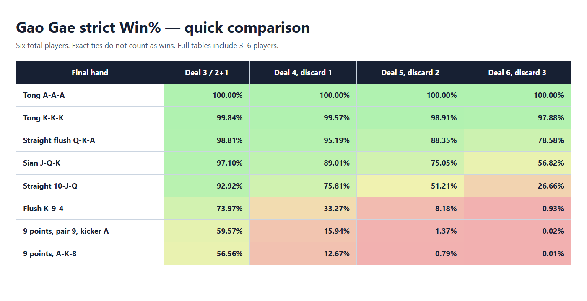

*รูปที่ 5.1 Estimated Win% ของมืออ้างอิง 8 มือ เมื่อมีผู้เล่นรวม 6 คน เปรียบเทียบ d3, d4, d5 และ d6 สีของช่องช่วยอ่านระดับเปอร์เซ็นต์และไม่ได้กำหนดคำแนะนำให้เล่นหรือหมอบ*

ตอง A-A-A มีค่า 100% ภายใต้แบบจำลอง เพราะเมื่อ hero ถือ A สามใบ คู่แข่งไม่สามารถสร้างตอง A-A-A อีกมือจากสำรับเดียวกัน และไม่มีหมวดสูงกว่าตอง ส่วนมืออันดับรองลงมามี Win% ลดลงเมื่อจำนวนไพ่ที่แจกเพิ่ม เพราะคู่แข่งทุกคนมีโอกาสสร้างมือสูงมากขึ้น

### 5.5 ผลของจำนวนผู้เล่น: กรณี 9-9-A♠

ตารางที่ 5.5 แสดงกรณี 9 แต้ม คู่ 9 kicker A♠ ซึ่งเป็นมือแต้มระดับสูง เมื่อจำนวนผู้เล่นรวมเพิ่มจาก 3 เป็น 6 คน Win% ลดลงทุกกติกา และเมื่อเพิ่มจำนวนไพ่ที่แจก Win% ของมือเดิมลดลงมากเช่นกัน

| วิธีแจก | ผู้เล่น 3 คน | ผู้เล่น 4 คน | ผู้เล่น 5 คน | ผู้เล่น 6 คน |
|---|---:|---:|---:|---:|
| d3 แจก 3 | 81.63% | 73.78% | 66.69% | 60.29% |
| d4 แจก 4 ทิ้ง 1 | 47.92% | 33.20% | 23.02% | 15.98% |
| d5 แจก 5 ทิ้ง 2 | 17.89% | 7.58% | 3.22% | 1.39% |
| d6 แจก 6 ทิ้ง 3 | 3.63% | 0.70% | 0.13% | 0.02% |

ตัวอย่างนี้แสดงว่าคำว่า “9 แต้ม คู่ 9 เป็นไพ่ใหญ่” ยังไม่พอสำหรับประเมินโอกาสชนะ ต้องระบุจำนวนผู้เล่นที่เปิดไพ่และวิธีแจกพร้อมกัน

### 5.6 จำนวน observations และความระมัดระวังในการอ่านค่าหายาก

ตารางที่ 5.6 แสดงแถวที่มีตัวอย่างน้อย ใน d3 และ d4 ไม่มีแถวใดต่ำกว่า 1,000 observations แต่ d5 มี 92 แถวและ d6 มี 190 แถวต่ำกว่าเกณฑ์ โดย d6 มีแถวต่ำสุดเพียง 47 observations ค่าของแถวดังกล่าวควรใช้เป็นผลเบื้องต้น ไม่ควรตีความความต่างเล็กน้อยว่าเป็นความแตกต่างจริง

| ขนาดการแจก | แถวต่ำกว่า 1,000 | ต่ำสุด | ตัวอย่างแถวต่ำสุด | observations สูงสุด |
|---|---:|---:|---|---:|
| d3 | 0 | 2,552 | สี A-4-3♣ | 41,292 |
| d4 | 0 | 1,272 | 0 แต้ม คู่ K, kicker 10♦ | 149,371 |
| d5 | 92 | 387 | 4 แต้ม คู่ 5, kicker 4♦ | 345,033 |
| d6 | 190 | 47 | 5 แต้ม คู่ K, kicker 5♦ | 621,832 |

ตัวเลข `0.00%` ในภาพหรือ `0.0000%` ใน CSV อาจเกิดจากการปัดหรือไม่มีชัยชนะใน observations ที่พบ ไม่ได้พิสูจน์ว่าความน่าจะเป็นเชิงทฤษฎีเป็นศูนย์

### 5.7 ตาราง Win% ฉบับเต็ม

รูปที่ 5.2–5.95 แสดงทุก strength row ที่เข้าถึงได้ในผลปัจจุบัน โดยแบ่งรูปละไม่เกิน 100 แถวเพื่อให้เหมาะกับการวางในบทความ คอลัมน์ผู้เล่น 3, 4, 5 และ 6 หมายถึงจำนวนผู้เล่นรวมที่ showdown รวมผู้ถือมือในแถวนั้นแล้ว ไม่ใช่จำนวนคู่แข่ง ตารางควรอ่านร่วมกับ exact frequency และ observed sample count ไม่ควรใช้สีเพียงอย่างเดียวตัดสินความแม่นหรือการเล่น

#### 5.7.1 ไพ่สุดท้ายสามใบ (แจก 3 พร้อมกัน/2+1 เฉพาะแบบจำลอง showdown-only)

ตาราง d3 มี 2,925 แถว แบ่งเป็น 30 รูป โดยแต่ละรูปมีไม่เกิน 100 แถว


*รูปที่ 5.2 ตาราง Win% เต็มของ d3 ส่วนที่ 1/30 แถวที่ 1–100 จากทั้งหมด 2,925 แถว ตั้งแต่ Tong A-A-A ถึง Straight 9-10-J, control J♦*

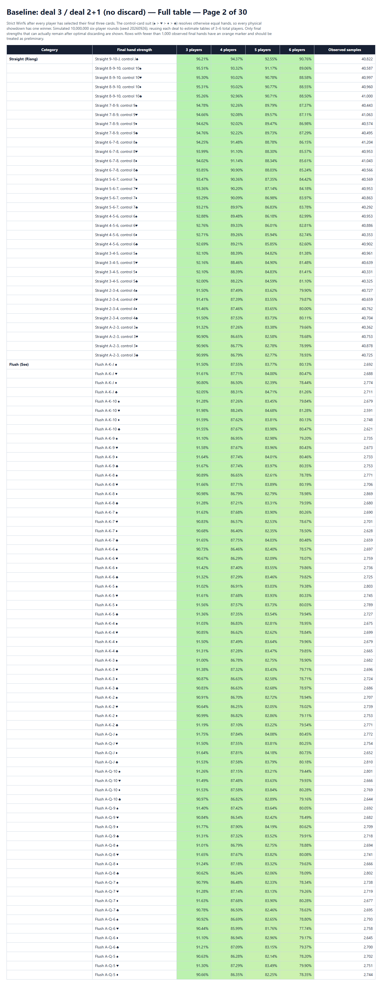

*รูปที่ 5.3 ตาราง Win% เต็มของ d3 ส่วนที่ 2/30 แถวที่ 101–200 จากทั้งหมด 2,925 แถว ตั้งแต่ Straight 9-10-J, control J♣ ถึง Flush A-Q-5 ♦*

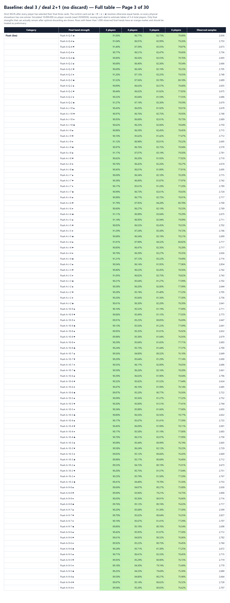

*รูปที่ 5.4 ตาราง Win% เต็มของ d3 ส่วนที่ 3/30 แถวที่ 201–300 จากทั้งหมด 2,925 แถว ตั้งแต่ Flush A-Q-5 ♣ ถึง Flush A-9-4 ♦*

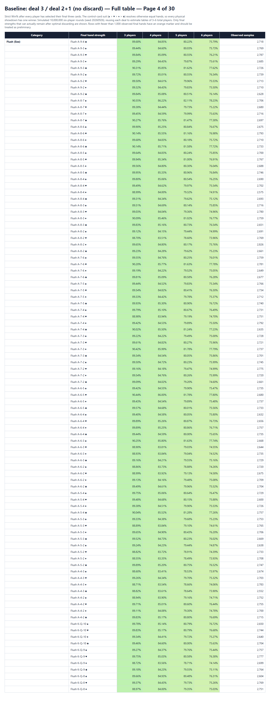

*รูปที่ 5.5 ตาราง Win% เต็มของ d3 ส่วนที่ 4/30 แถวที่ 301–400 จากทั้งหมด 2,925 แถว ตั้งแต่ Flush A-9-4 ♣ ถึง Flush K-Q-8 ♦*

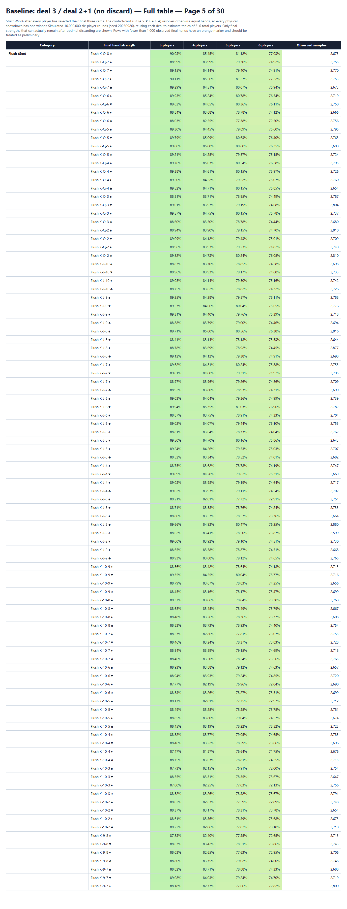

*รูปที่ 5.6 ตาราง Win% เต็มของ d3 ส่วนที่ 5/30 แถวที่ 401–500 จากทั้งหมด 2,925 แถว ตั้งแต่ Flush K-Q-8 ♣ ถึง Flush K-9-7 ♦*

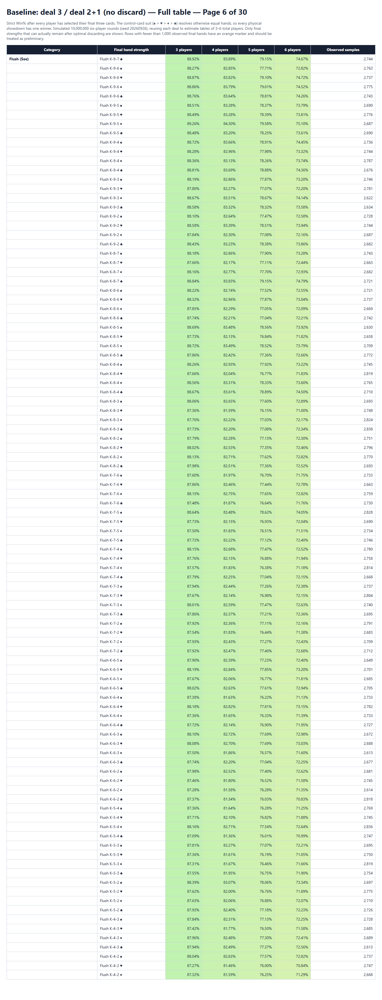

*รูปที่ 5.7 ตาราง Win% เต็มของ d3 ส่วนที่ 6/30 แถวที่ 501–600 จากทั้งหมด 2,925 แถว ตั้งแต่ Flush K-9-7 ♣ ถึง Flush K-4-2 ♦*

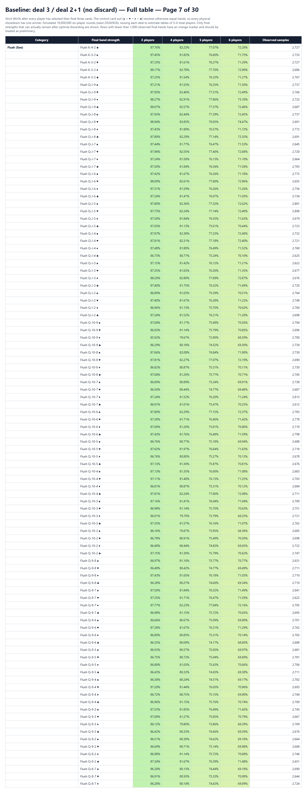

*รูปที่ 5.8 ตาราง Win% เต็มของ d3 ส่วนที่ 7/30 แถวที่ 601–700 จากทั้งหมด 2,925 แถว ตั้งแต่ Flush K-4-2 ♣ ถึง Flush Q-8-7 ♦*

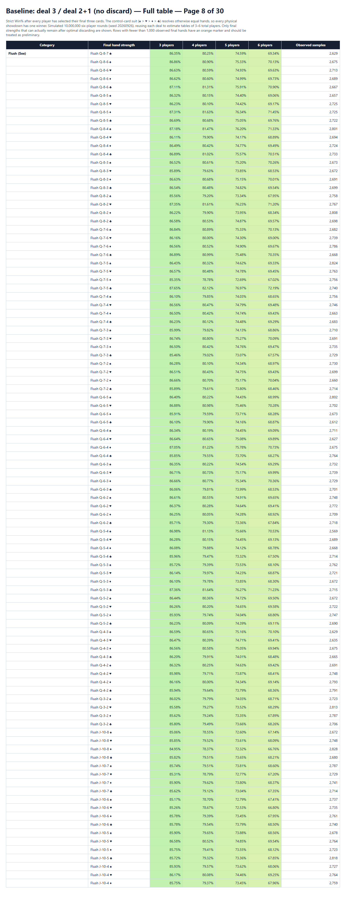

*รูปที่ 5.9 ตาราง Win% เต็มของ d3 ส่วนที่ 8/30 แถวที่ 701–800 จากทั้งหมด 2,925 แถว ตั้งแต่ Flush Q-8-7 ♣ ถึง Flush J-10-4 ♦*

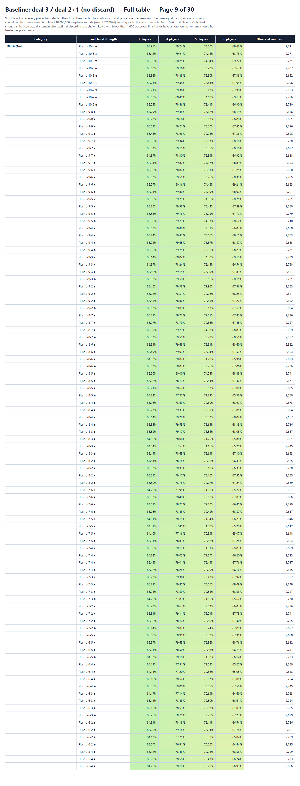

*รูปที่ 5.10 ตาราง Win% เต็มของ d3 ส่วนที่ 9/30 แถวที่ 801–900 จากทั้งหมด 2,925 แถว ตั้งแต่ Flush J-10-4 ♣ ถึง Flush J-5-4 ♦*

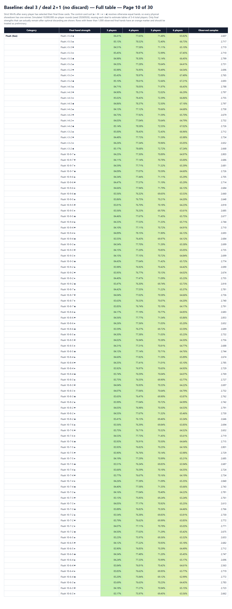

*รูปที่ 5.11 ตาราง Win% เต็มของ d3 ส่วนที่ 10/30 แถวที่ 901–1,000 จากทั้งหมด 2,925 แถว ตั้งแต่ Flush J-5-4 ♣ ถึง Flush 10-6-3 ♦*

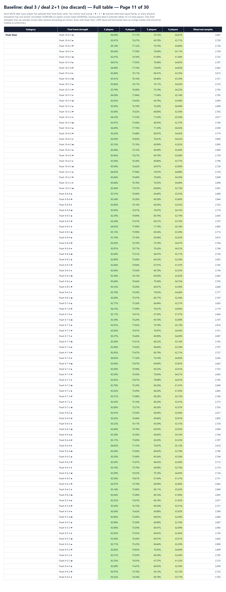

*รูปที่ 5.12 ตาราง Win% เต็มของ d3 ส่วนที่ 11/30 แถวที่ 1,001–1,100 จากทั้งหมด 2,925 แถว ตั้งแต่ Flush 10-6-3 ♣ ถึง Flush 9-4-3 ♦*

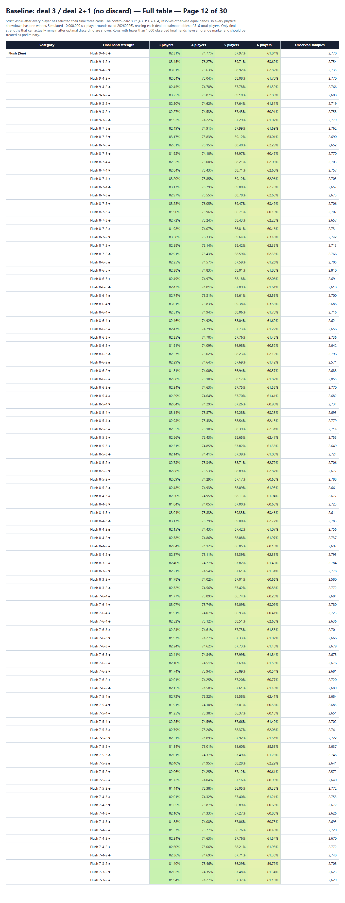

*รูปที่ 5.13 ตาราง Win% เต็มของ d3 ส่วนที่ 12/30 แถวที่ 1,101–1,200 จากทั้งหมด 2,925 แถว ตั้งแต่ Flush 9-4-3 ♣ ถึง Flush 7-3-2 ♦*

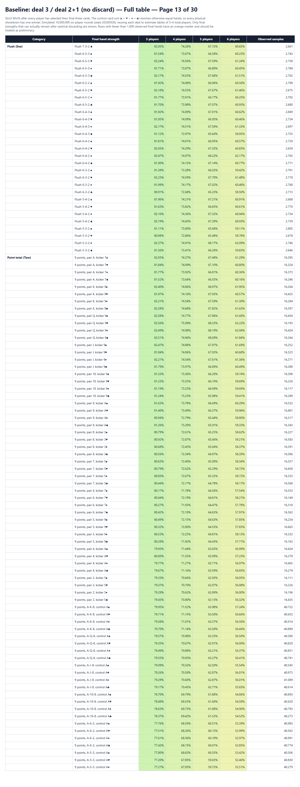

*รูปที่ 5.14 ตาราง Win% เต็มของ d3 ส่วนที่ 13/30 แถวที่ 1,201–1,300 จากทั้งหมด 2,925 แถว ตั้งแต่ Flush 7-3-2 ♣ ถึง 9 points, A-5-3, control A♦*

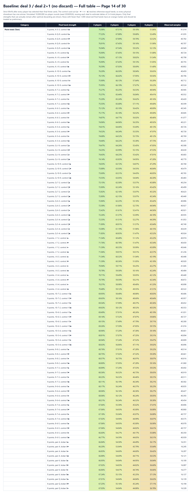

*รูปที่ 5.15 ตาราง Win% เต็มของ d3 ส่วนที่ 14/30 แถวที่ 1,301–1,400 จากทั้งหมด 2,925 แถว ตั้งแต่ 9 points, A-5-3, control A♣ ถึง 8 points, pair Q, kicker 8♦*

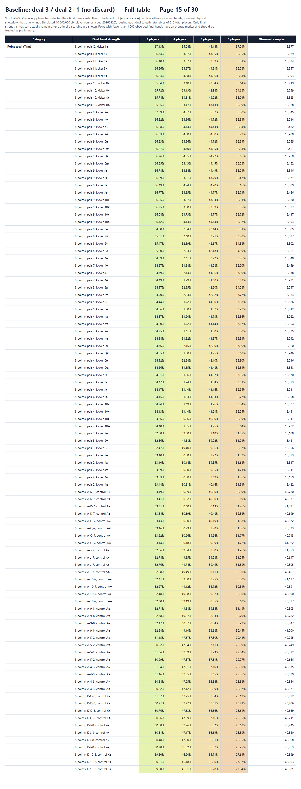

*รูปที่ 5.16 ตาราง Win% เต็มของ d3 ส่วนที่ 15/30 แถวที่ 1,401–1,500 จากทั้งหมด 2,925 แถว ตั้งแต่ 8 points, pair Q, kicker 8♣ ถึง 8 points, K-10-8, control K♦*

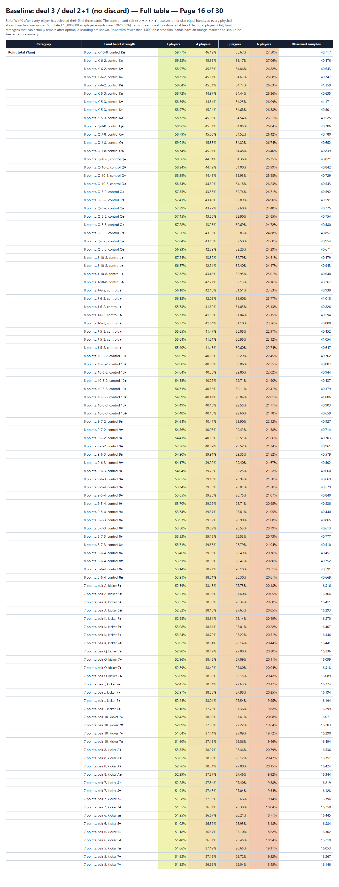

*รูปที่ 5.17 ตาราง Win% เต็มของ d3 ส่วนที่ 16/30 แถวที่ 1,501–1,600 จากทั้งหมด 2,925 แถว ตั้งแต่ 8 points, K-10-8, control K♣ ถึง 7 points, pair 5, kicker 7♦*


*รูปที่ 5.18 ตาราง Win% เต็มของ d3 ส่วนที่ 17/30 แถวที่ 1,601–1,700 จากทั้งหมด 2,925 แถว ตั้งแต่ 7 points, pair 5, kicker 7♣ ถึง 7 points, 10-5-2, control 10♦*

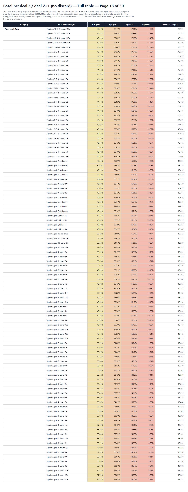

*รูปที่ 5.19 ตาราง Win% เต็มของ d3 ส่วนที่ 18/30 แถวที่ 1,701–1,800 จากทั้งหมด 2,925 แถว ตั้งแต่ 7 points, 10-5-2, control 10♣ ถึง 6 points, pair 3, kicker 10♦*


*รูปที่ 5.20 ตาราง Win% เต็มของ d3 ส่วนที่ 19/30 แถวที่ 1,801–1,900 จากทั้งหมด 2,925 แถว ตั้งแต่ 6 points, pair 3, kicker 10♣ ถึง 6 points, 7-6-3, control 7♦*

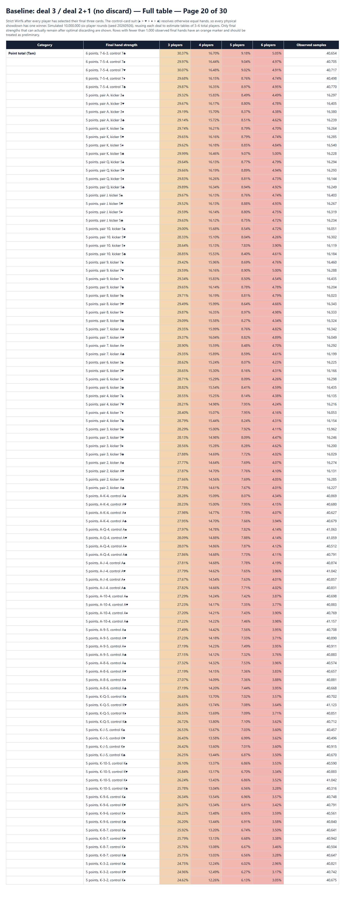

*รูปที่ 5.21 ตาราง Win% เต็มของ d3 ส่วนที่ 20/30 แถวที่ 1,901–2,000 จากทั้งหมด 2,925 แถว ตั้งแต่ 6 points, 7-6-3, control 7♣ ถึง 5 points, K-3-2, control K♦*

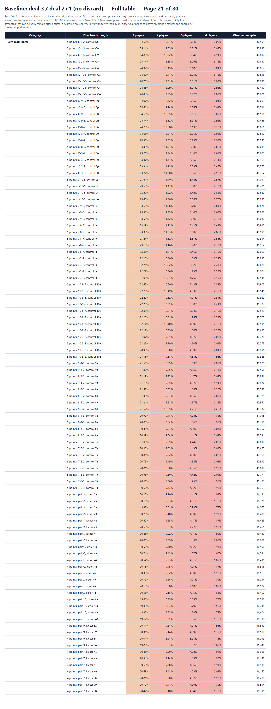

*รูปที่ 5.22 ตาราง Win% เต็มของ d3 ส่วนที่ 21/30 แถวที่ 2,001–2,100 จากทั้งหมด 2,925 แถว ตั้งแต่ 5 points, K-3-2, control K♣ ถึง 4 points, pair 7, kicker Q♦*

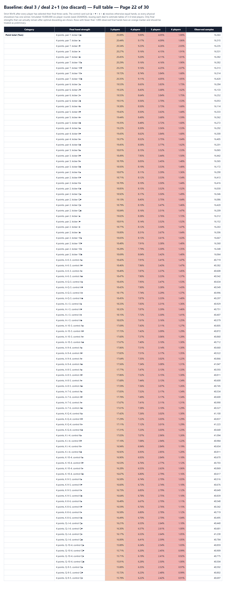

*รูปที่ 5.23 ตาราง Win% เต็มของ d3 ส่วนที่ 22/30 แถวที่ 2,101–2,200 จากทั้งหมด 2,925 แถว ตั้งแต่ 4 points, pair 7, kicker Q♣ ถึง 4 points, Q-9-5, control Q♦*


*รูปที่ 5.24 ตาราง Win% เต็มของ d3 ส่วนที่ 23/30 แถวที่ 2,201–2,300 จากทั้งหมด 2,925 แถว ตั้งแต่ 4 points, Q-9-5, control Q♣ ถึง 3 points, A-Q-2, control A♦*

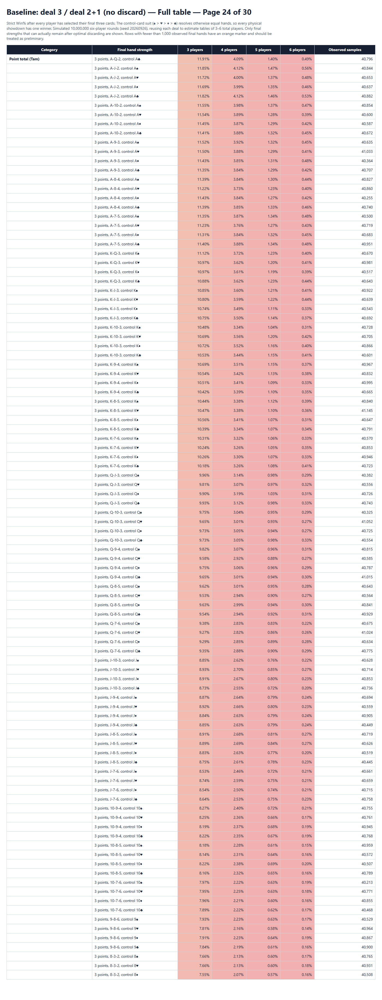

*รูปที่ 5.25 ตาราง Win% เต็มของ d3 ส่วนที่ 24/30 แถวที่ 2,301–2,400 จากทั้งหมด 2,925 แถว ตั้งแต่ 3 points, A-Q-2, control A♣ ถึง 3 points, 8-3-2, control 8♦*

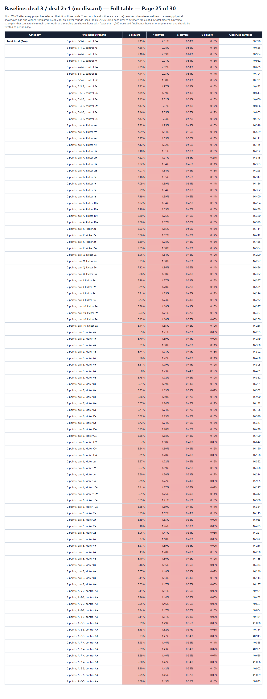

*รูปที่ 5.26 ตาราง Win% เต็มของ d3 ส่วนที่ 25/30 แถวที่ 2,401–2,500 จากทั้งหมด 2,925 แถว ตั้งแต่ 3 points, 8-3-2, control 8♣ ถึง 2 points, A-6-5, control A♦*


*รูปที่ 5.27 ตาราง Win% เต็มของ d3 ส่วนที่ 26/30 แถวที่ 2,501–2,600 จากทั้งหมด 2,925 แถว ตั้งแต่ 2 points, A-6-5, control A♣ ถึง 1 points, pair Q, kicker A♦*

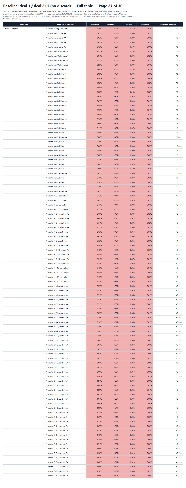

*รูปที่ 5.28 ตาราง Win% เต็มของ d3 ส่วนที่ 27/30 แถวที่ 2,601–2,700 จากทั้งหมด 2,925 แถว ตั้งแต่ 1 points, pair Q, kicker A♣ ถึง 1 points, Q-6-5, control Q♦*

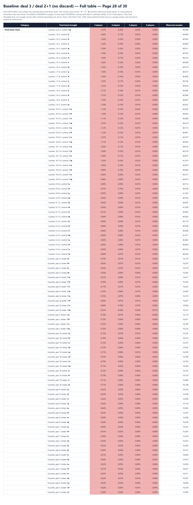

*รูปที่ 5.29 ตาราง Win% เต็มของ d3 ส่วนที่ 28/30 แถวที่ 2,701–2,800 จากทั้งหมด 2,925 แถว ตั้งแต่ 1 points, Q-6-5, control Q♣ ถึง 0 points, pair 5, kicker Q♦*


*รูปที่ 5.30 ตาราง Win% เต็มของ d3 ส่วนที่ 29/30 แถวที่ 2,801–2,900 จากทั้งหมด 2,925 แถว ตั้งแต่ 0 points, pair 5, kicker Q♣ ถึง 0 points, 10-7-3, control 10♦*

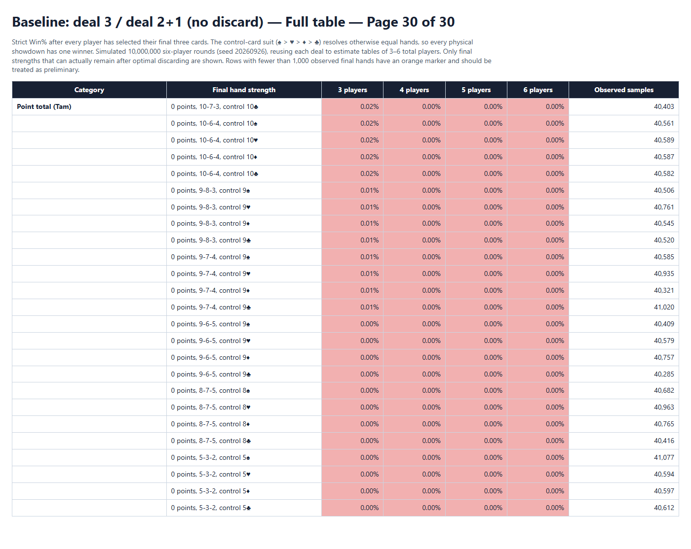

*รูปที่ 5.31 ตาราง Win% เต็มของ d3 ส่วนที่ 30/30 แถวที่ 2,901–2,925 จากทั้งหมด 2,925 แถว ตั้งแต่ 0 points, 10-7-3, control 10♣ ถึง 0 points, 5-3-2, control 5♣*

#### 5.7.2 แจก 4 ทิ้ง 1

ตาราง d4 มี 2,323 แถว แบ่งเป็น 24 รูป โดยแต่ละรูปมีไม่เกิน 100 แถว


*รูปที่ 5.32 ตาราง Win% เต็มของ d4 ส่วนที่ 1/24 แถวที่ 1–100 จากทั้งหมด 2,323 แถว ตั้งแต่ Tong A-A-A ถึง Straight 9-10-J, control J♦*


*รูปที่ 5.33 ตาราง Win% เต็มของ d4 ส่วนที่ 2/24 แถวที่ 101–200 จากทั้งหมด 2,323 แถว ตั้งแต่ Straight 9-10-J, control J♣ ถึง Flush A-Q-5 ♦*

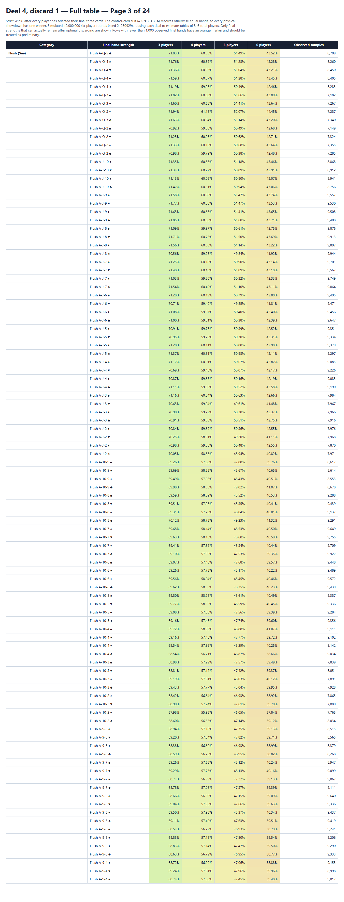

*รูปที่ 5.34 ตาราง Win% เต็มของ d4 ส่วนที่ 3/24 แถวที่ 201–300 จากทั้งหมด 2,323 แถว ตั้งแต่ Flush A-Q-5 ♣ ถึง Flush A-9-4 ♦*

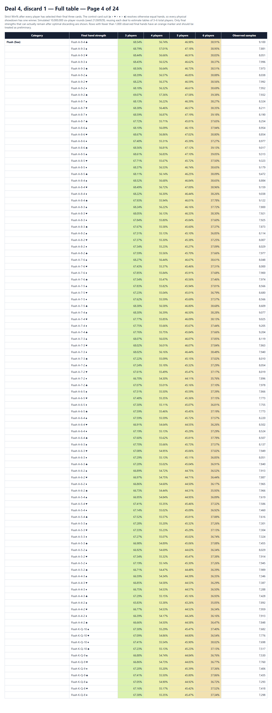

*รูปที่ 5.35 ตาราง Win% เต็มของ d4 ส่วนที่ 4/24 แถวที่ 301–400 จากทั้งหมด 2,323 แถว ตั้งแต่ Flush A-9-4 ♣ ถึง Flush K-Q-8 ♦*


*รูปที่ 5.36 ตาราง Win% เต็มของ d4 ส่วนที่ 5/24 แถวที่ 401–500 จากทั้งหมด 2,323 แถว ตั้งแต่ Flush K-Q-8 ♣ ถึง Flush K-9-7 ♦*

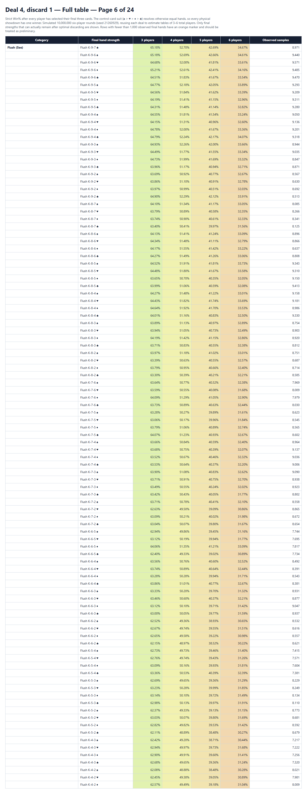

*รูปที่ 5.37 ตาราง Win% เต็มของ d4 ส่วนที่ 6/24 แถวที่ 501–600 จากทั้งหมด 2,323 แถว ตั้งแต่ Flush K-9-7 ♣ ถึง Flush K-4-2 ♦*

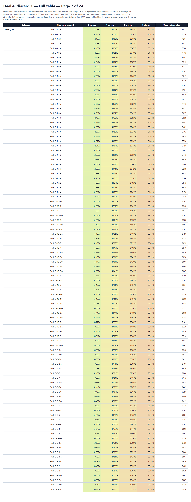

*รูปที่ 5.38 ตาราง Win% เต็มของ d4 ส่วนที่ 7/24 แถวที่ 601–700 จากทั้งหมด 2,323 แถว ตั้งแต่ Flush K-4-2 ♣ ถึง Flush Q-8-7 ♦*

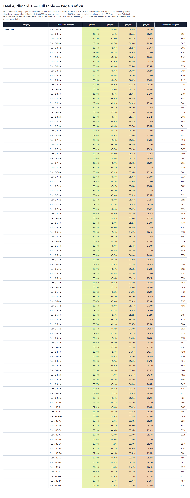

*รูปที่ 5.39 ตาราง Win% เต็มของ d4 ส่วนที่ 8/24 แถวที่ 701–800 จากทั้งหมด 2,323 แถว ตั้งแต่ Flush Q-8-7 ♣ ถึง Flush J-10-4 ♦*

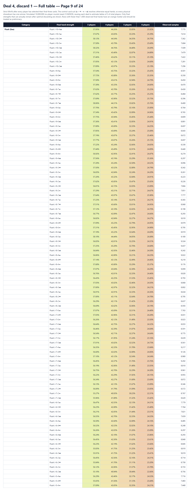

*รูปที่ 5.40 ตาราง Win% เต็มของ d4 ส่วนที่ 9/24 แถวที่ 801–900 จากทั้งหมด 2,323 แถว ตั้งแต่ Flush J-10-4 ♣ ถึง Flush J-5-4 ♦*

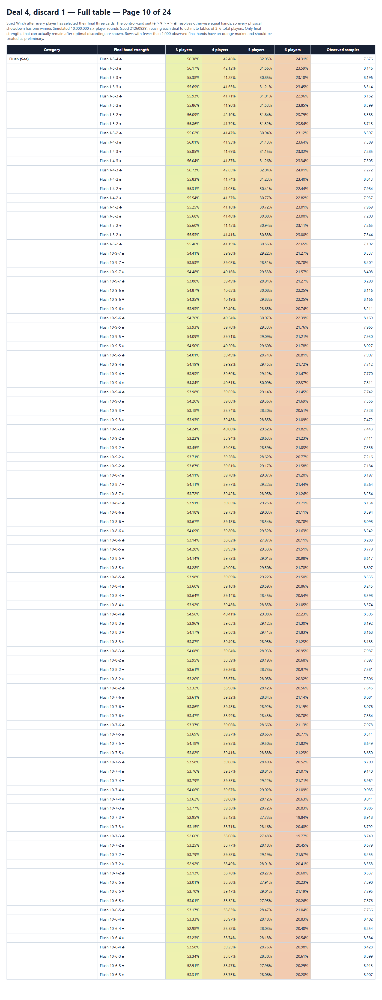

*รูปที่ 5.41 ตาราง Win% เต็มของ d4 ส่วนที่ 10/24 แถวที่ 901–1,000 จากทั้งหมด 2,323 แถว ตั้งแต่ Flush J-5-4 ♣ ถึง Flush 10-6-3 ♦*

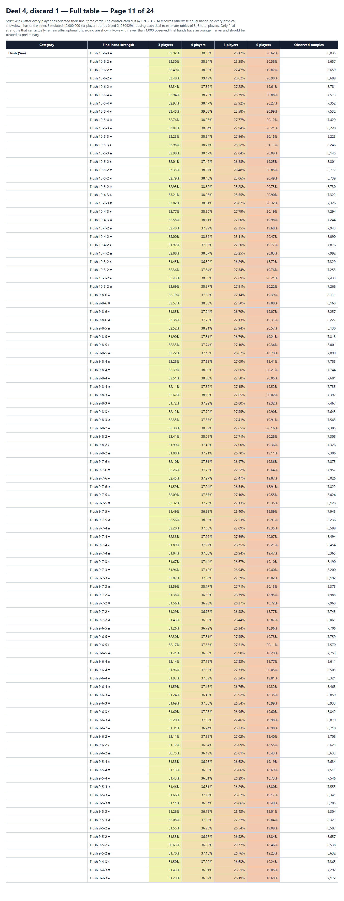

*รูปที่ 5.42 ตาราง Win% เต็มของ d4 ส่วนที่ 11/24 แถวที่ 1,001–1,100 จากทั้งหมด 2,323 แถว ตั้งแต่ Flush 10-6-3 ♣ ถึง Flush 9-4-3 ♦*

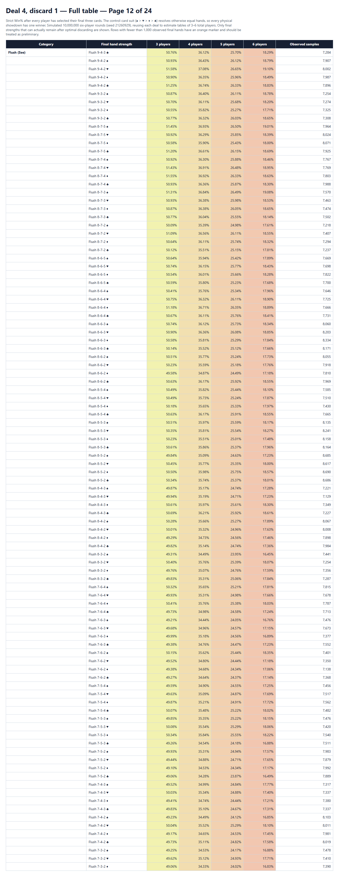

*รูปที่ 5.43 ตาราง Win% เต็มของ d4 ส่วนที่ 12/24 แถวที่ 1,101–1,200 จากทั้งหมด 2,323 แถว ตั้งแต่ Flush 9-4-3 ♣ ถึง Flush 7-3-2 ♦*

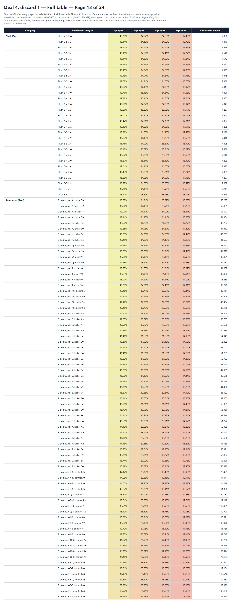

*รูปที่ 5.44 ตาราง Win% เต็มของ d4 ส่วนที่ 13/24 แถวที่ 1,201–1,300 จากทั้งหมด 2,323 แถว ตั้งแต่ Flush 7-3-2 ♣ ถึง 9 points, A-5-3, control A♦*

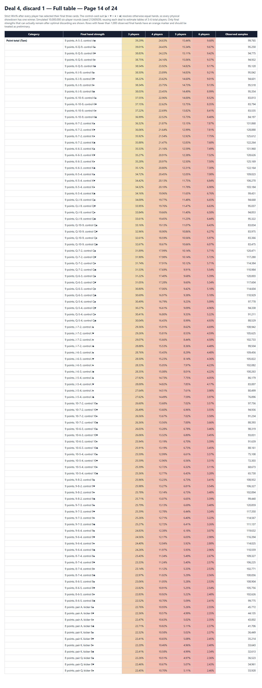

*รูปที่ 5.45 ตาราง Win% เต็มของ d4 ส่วนที่ 14/24 แถวที่ 1,301–1,400 จากทั้งหมด 2,323 แถว ตั้งแต่ 9 points, A-5-3, control A♣ ถึง 8 points, pair Q, kicker 8♦*


*รูปที่ 5.46 ตาราง Win% เต็มของ d4 ส่วนที่ 15/24 แถวที่ 1,401–1,500 จากทั้งหมด 2,323 แถว ตั้งแต่ 8 points, pair Q, kicker 8♣ ถึง 8 points, K-10-8, control K♦*

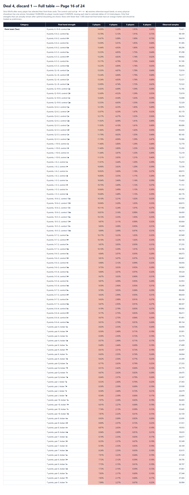

*รูปที่ 5.47 ตาราง Win% เต็มของ d4 ส่วนที่ 16/24 แถวที่ 1,501–1,600 จากทั้งหมด 2,323 แถว ตั้งแต่ 8 points, K-10-8, control K♣ ถึง 7 points, pair 5, kicker 7♦*


*รูปที่ 5.48 ตาราง Win% เต็มของ d4 ส่วนที่ 17/24 แถวที่ 1,601–1,700 จากทั้งหมด 2,323 แถว ตั้งแต่ 7 points, pair 5, kicker 7♣ ถึง 7 points, 10-5-2, control 10♦*


*รูปที่ 5.49 ตาราง Win% เต็มของ d4 ส่วนที่ 18/24 แถวที่ 1,701–1,800 จากทั้งหมด 2,323 แถว ตั้งแต่ 7 points, 10-5-2, control 10♣ ถึง 6 points, pair 3, kicker 10♦*


*รูปที่ 5.50 ตาราง Win% เต็มของ d4 ส่วนที่ 19/24 แถวที่ 1,801–1,900 จากทั้งหมด 2,323 แถว ตั้งแต่ 6 points, pair 3, kicker 10♣ ถึง 6 points, 7-6-3, control 7♣*


*รูปที่ 5.51 ตาราง Win% เต็มของ d4 ส่วนที่ 20/24 แถวที่ 1,901–2,000 จากทั้งหมด 2,323 แถว ตั้งแต่ 6 points, 7-5-4, control 7♠ ถึง 5 points, Q-J-5, control Q♣*


*รูปที่ 5.52 ตาราง Win% เต็มของ d4 ส่วนที่ 21/24 แถวที่ 2,001–2,100 จากทั้งหมด 2,323 แถว ตั้งแต่ 5 points, Q-10-5, control Q♠ ถึง 4 points, pair 6, kicker 2♠*


*รูปที่ 5.53 ตาราง Win% เต็มของ d4 ส่วนที่ 22/24 แถวที่ 2,101–2,200 จากทั้งหมด 2,323 แถว ตั้งแต่ 4 points, pair 6, kicker 2♥ ถึง 3 points, pair 7, kicker 9♦*

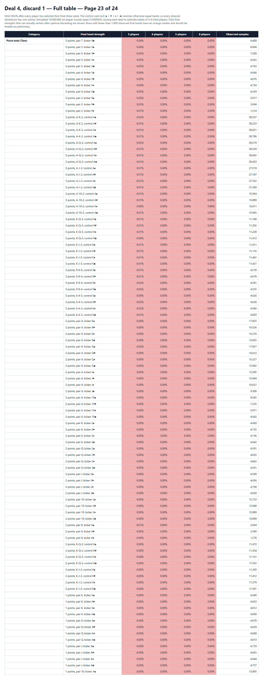

*รูปที่ 5.54 ตาราง Win% เต็มของ d4 ส่วนที่ 23/24 แถวที่ 2,201–2,300 จากทั้งหมด 2,323 แถว ตั้งแต่ 3 points, pair 7, kicker 9♣ ถึง 1 points, pair 10, kicker A♠*

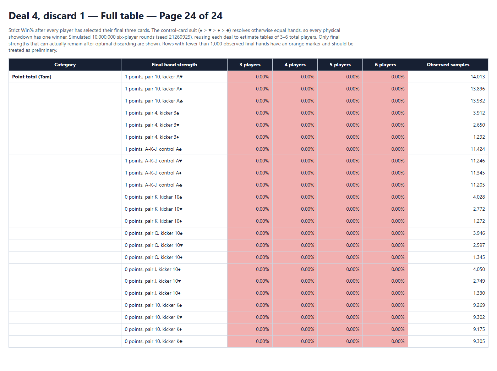

*รูปที่ 5.55 ตาราง Win% เต็มของ d4 ส่วนที่ 24/24 แถวที่ 2,301–2,323 จากทั้งหมด 2,323 แถว ตั้งแต่ 1 points, pair 10, kicker A♥ ถึง 0 points, pair 10, kicker K♣*

#### 5.7.3 แจก 5 ทิ้ง 2

ตาราง d5 มี 2,049 แถว แบ่งเป็น 21 รูป โดยแต่ละรูปมีไม่เกิน 100 แถว

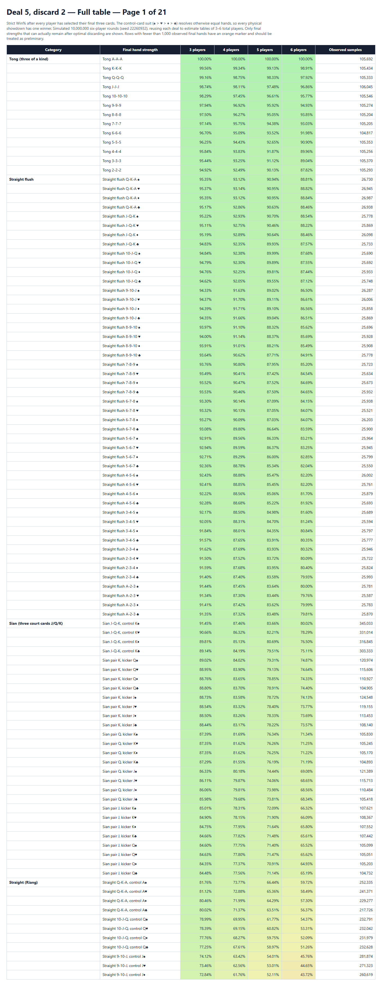

*รูปที่ 5.56 ตาราง Win% เต็มของ d5 ส่วนที่ 1/21 แถวที่ 1–100 จากทั้งหมด 2,049 แถว ตั้งแต่ Tong A-A-A ถึง Straight 9-10-J, control J♦*


*รูปที่ 5.57 ตาราง Win% เต็มของ d5 ส่วนที่ 2/21 แถวที่ 101–200 จากทั้งหมด 2,049 แถว ตั้งแต่ Straight 9-10-J, control J♣ ถึง Flush A-Q-5 ♦*


*รูปที่ 5.58 ตาราง Win% เต็มของ d5 ส่วนที่ 3/21 แถวที่ 201–300 จากทั้งหมด 2,049 แถว ตั้งแต่ Flush A-Q-5 ♣ ถึง Flush A-9-4 ♦*


*รูปที่ 5.59 ตาราง Win% เต็มของ d5 ส่วนที่ 4/21 แถวที่ 301–400 จากทั้งหมด 2,049 แถว ตั้งแต่ Flush A-9-4 ♣ ถึง Flush K-Q-8 ♦*

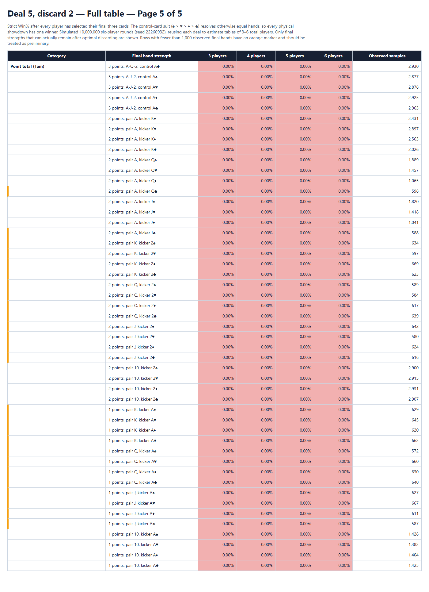

*รูปที่ 5.60 ตาราง Win% เต็มของ d5 ส่วนที่ 5/21 แถวที่ 401–500 จากทั้งหมด 2,049 แถว ตั้งแต่ Flush K-Q-8 ♣ ถึง Flush K-9-7 ♦*

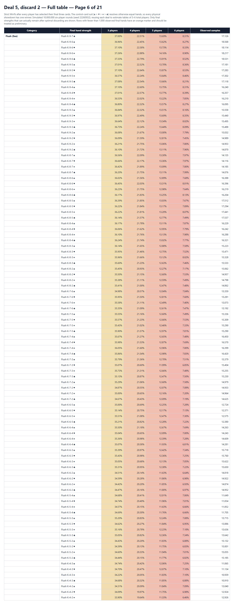

*รูปที่ 5.61 ตาราง Win% เต็มของ d5 ส่วนที่ 6/21 แถวที่ 501–600 จากทั้งหมด 2,049 แถว ตั้งแต่ Flush K-9-7 ♣ ถึง Flush K-4-2 ♦*

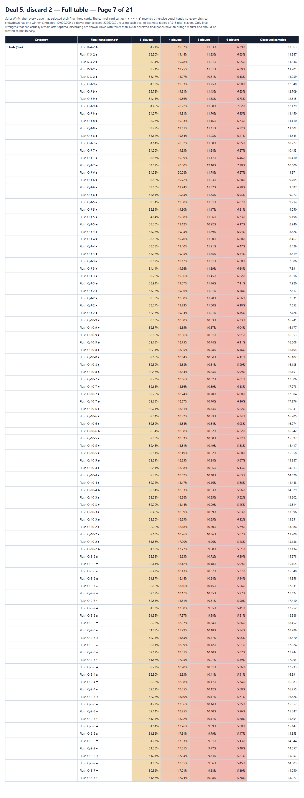

*รูปที่ 5.62 ตาราง Win% เต็มของ d5 ส่วนที่ 7/21 แถวที่ 601–700 จากทั้งหมด 2,049 แถว ตั้งแต่ Flush K-4-2 ♣ ถึง Flush Q-8-7 ♦*


*รูปที่ 5.63 ตาราง Win% เต็มของ d5 ส่วนที่ 8/21 แถวที่ 701–800 จากทั้งหมด 2,049 แถว ตั้งแต่ Flush Q-8-7 ♣ ถึง Flush J-10-4 ♦*

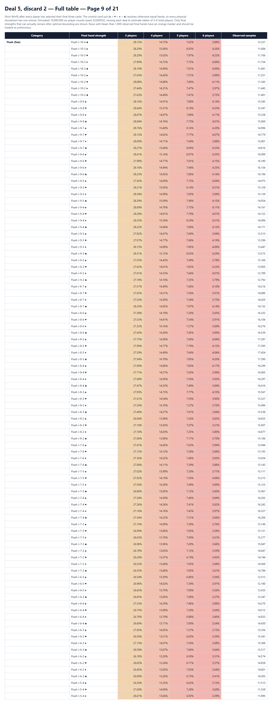

*รูปที่ 5.64 ตาราง Win% เต็มของ d5 ส่วนที่ 9/21 แถวที่ 801–900 จากทั้งหมด 2,049 แถว ตั้งแต่ Flush J-10-4 ♣ ถึง Flush J-5-4 ♦*

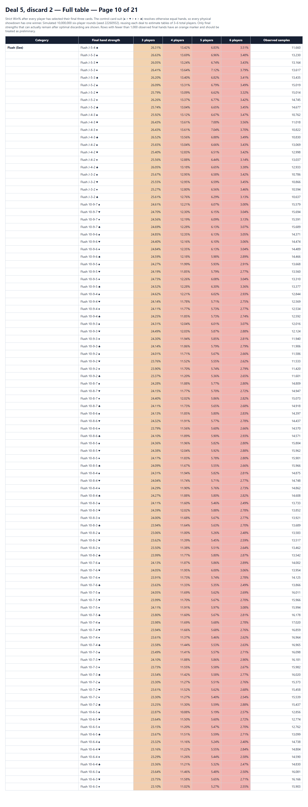

*รูปที่ 5.65 ตาราง Win% เต็มของ d5 ส่วนที่ 10/21 แถวที่ 901–1,000 จากทั้งหมด 2,049 แถว ตั้งแต่ Flush J-5-4 ♣ ถึง Flush 10-6-3 ♦*

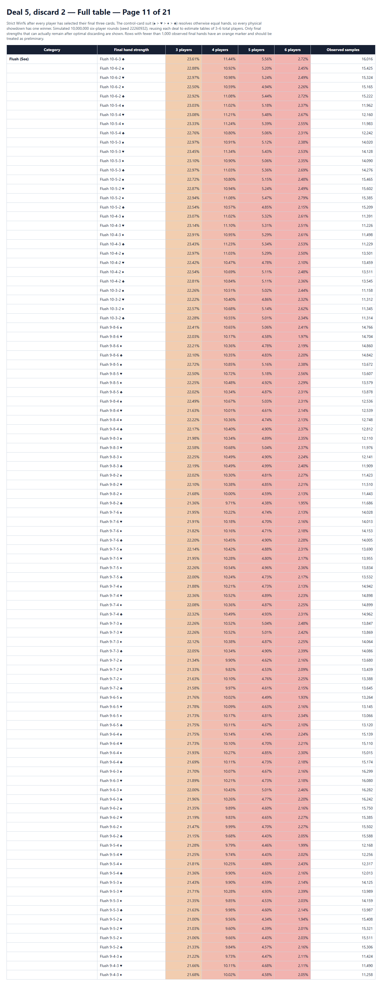

*รูปที่ 5.66 ตาราง Win% เต็มของ d5 ส่วนที่ 11/21 แถวที่ 1,001–1,100 จากทั้งหมด 2,049 แถว ตั้งแต่ Flush 10-6-3 ♣ ถึง Flush 9-4-3 ♦*

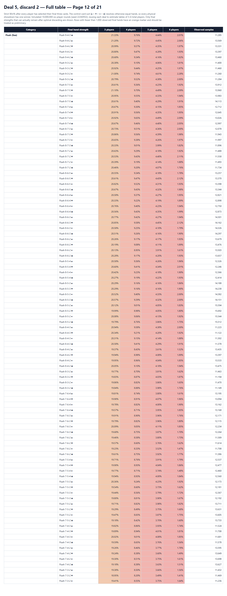

*รูปที่ 5.67 ตาราง Win% เต็มของ d5 ส่วนที่ 12/21 แถวที่ 1,101–1,200 จากทั้งหมด 2,049 แถว ตั้งแต่ Flush 9-4-3 ♣ ถึง Flush 7-3-2 ♦*

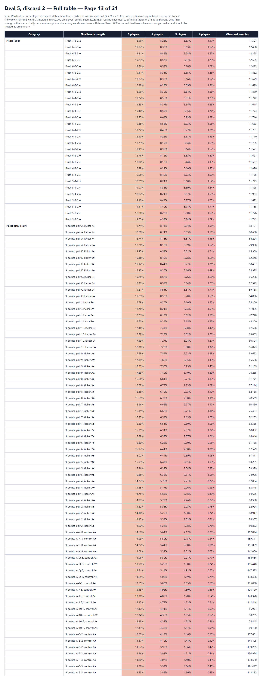

*รูปที่ 5.68 ตาราง Win% เต็มของ d5 ส่วนที่ 13/21 แถวที่ 1,201–1,300 จากทั้งหมด 2,049 แถว ตั้งแต่ Flush 7-3-2 ♣ ถึง 9 points, A-5-3, control A♦*

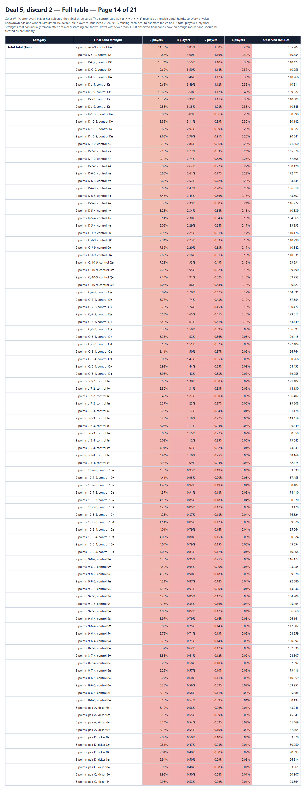

*รูปที่ 5.69 ตาราง Win% เต็มของ d5 ส่วนที่ 14/21 แถวที่ 1,301–1,400 จากทั้งหมด 2,049 แถว ตั้งแต่ 9 points, A-5-3, control A♣ ถึง 8 points, pair Q, kicker 8♦*

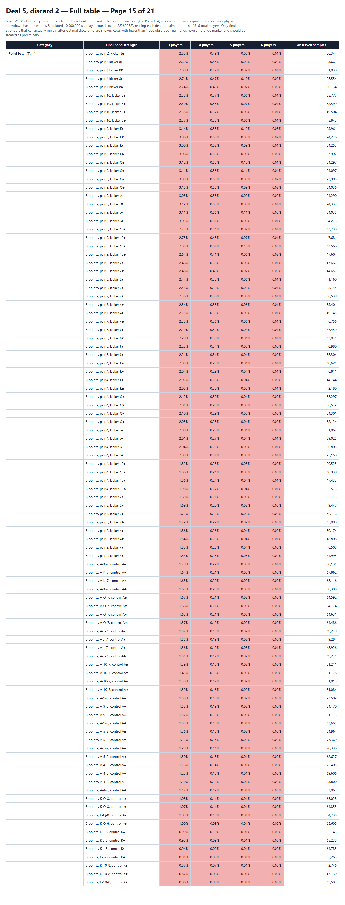

*รูปที่ 5.70 ตาราง Win% เต็มของ d5 ส่วนที่ 15/21 แถวที่ 1,401–1,500 จากทั้งหมด 2,049 แถว ตั้งแต่ 8 points, pair Q, kicker 8♣ ถึง 8 points, K-10-8, control K♦*


*รูปที่ 5.71 ตาราง Win% เต็มของ d5 ส่วนที่ 16/21 แถวที่ 1,501–1,600 จากทั้งหมด 2,049 แถว ตั้งแต่ 8 points, K-10-8, control K♣ ถึง 7 points, pair 5, kicker 7♦*


*รูปที่ 5.72 ตาราง Win% เต็มของ d5 ส่วนที่ 17/21 แถวที่ 1,601–1,700 จากทั้งหมด 2,049 แถว ตั้งแต่ 7 points, pair 5, kicker 7♣ ถึง 7 points, 10-5-2, control 10♦*


*รูปที่ 5.73 ตาราง Win% เต็มของ d5 ส่วนที่ 18/21 แถวที่ 1,701–1,800 จากทั้งหมด 2,049 แถว ตั้งแต่ 7 points, 10-4-3, control 10♠ ถึง 6 points, A-Q-5, control A♠*


*รูปที่ 5.74 ตาราง Win% เต็มของ d5 ส่วนที่ 19/21 แถวที่ 1,801–1,900 จากทั้งหมด 2,049 แถว ตั้งแต่ 6 points, A-Q-5, control A♥ ถึง 5 points, A-Q-4, control A♥*


*รูปที่ 5.75 ตาราง Win% เต็มของ d5 ส่วนที่ 20/21 แถวที่ 1,901–2,000 จากทั้งหมด 2,049 แถว ตั้งแต่ 5 points, A-Q-4, control A♦ ถึง 3 points, A-Q-2, control A♦*

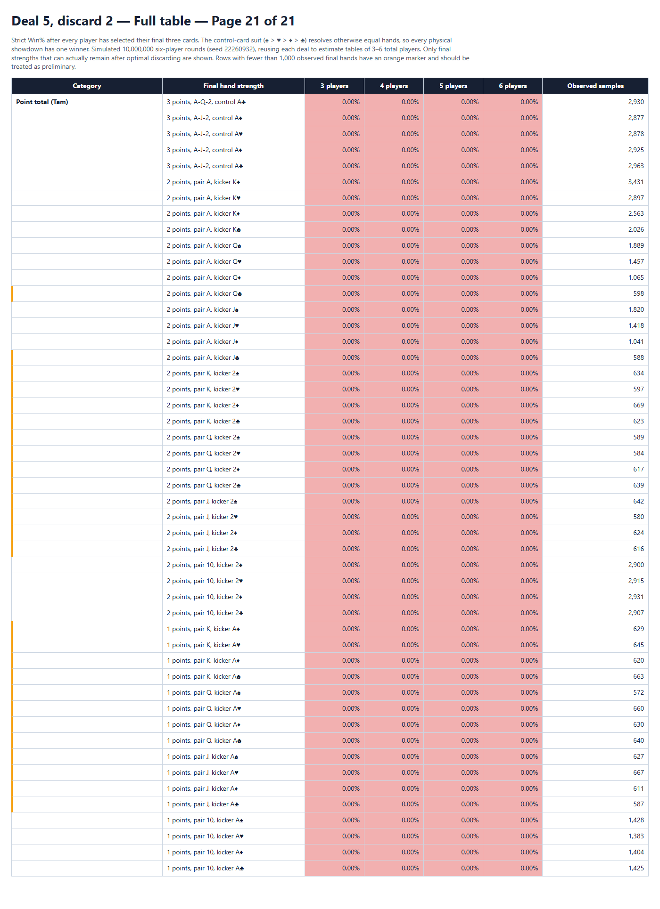

*รูปที่ 5.76 ตาราง Win% เต็มของ d5 ส่วนที่ 21/21 แถวที่ 2,001–2,049 จากทั้งหมด 2,049 แถว ตั้งแต่ 3 points, A-Q-2, control A♣ ถึง 1 points, pair 10, kicker A♣*

#### 5.7.4 แจก 6 ทิ้ง 3

ตาราง d6 มี 1,857 แถว แบ่งเป็น 19 รูป โดยแต่ละรูปมีไม่เกิน 100 แถว

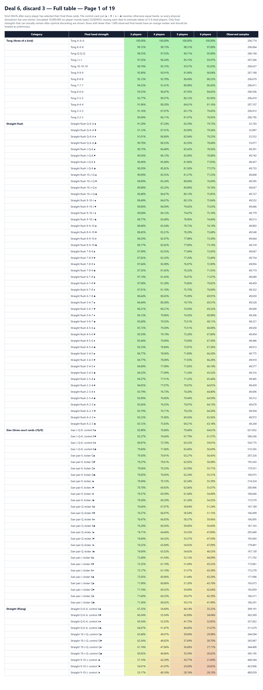

*รูปที่ 5.77 ตาราง Win% เต็มของ d6 ส่วนที่ 1/19 แถวที่ 1–100 จากทั้งหมด 1,857 แถว ตั้งแต่ Tong A-A-A ถึง Straight 9-10-J, control J♦*

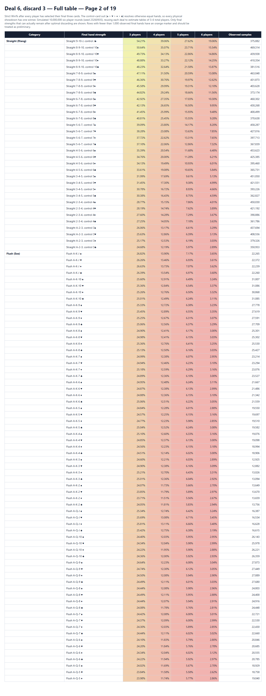

*รูปที่ 5.78 ตาราง Win% เต็มของ d6 ส่วนที่ 2/19 แถวที่ 101–200 จากทั้งหมด 1,857 แถว ตั้งแต่ Straight 9-10-J, control J♣ ถึง Flush A-Q-5 ♦*

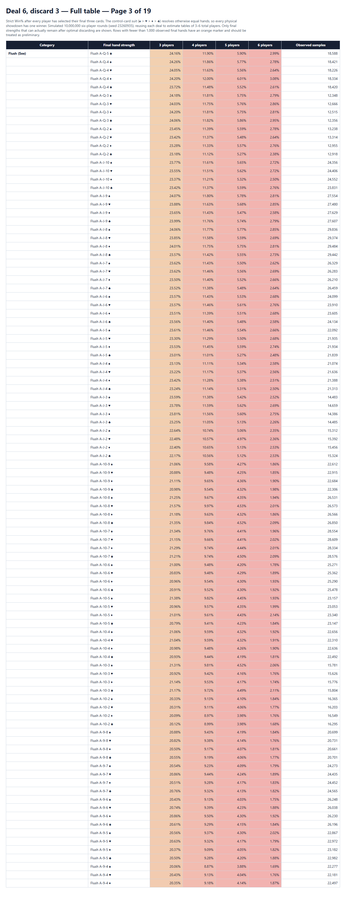

*รูปที่ 5.79 ตาราง Win% เต็มของ d6 ส่วนที่ 3/19 แถวที่ 201–300 จากทั้งหมด 1,857 แถว ตั้งแต่ Flush A-Q-5 ♣ ถึง Flush A-9-4 ♦*

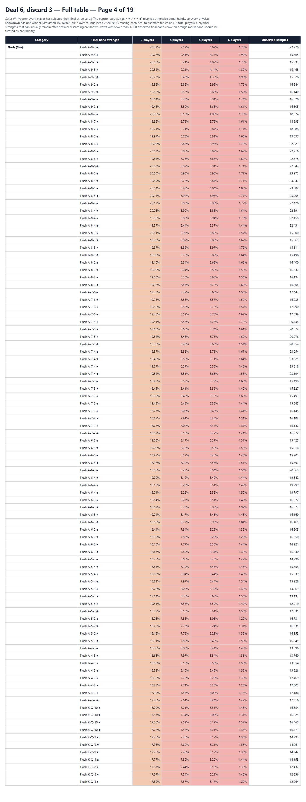

*รูปที่ 5.80 ตาราง Win% เต็มของ d6 ส่วนที่ 4/19 แถวที่ 301–400 จากทั้งหมด 1,857 แถว ตั้งแต่ Flush A-9-4 ♣ ถึง Flush K-Q-8 ♦*

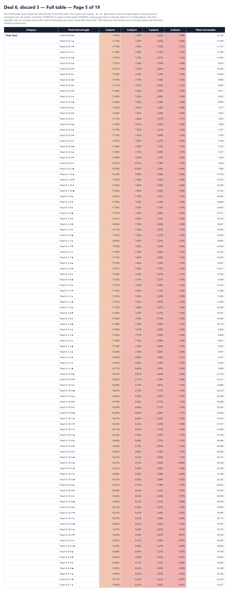

*รูปที่ 5.81 ตาราง Win% เต็มของ d6 ส่วนที่ 5/19 แถวที่ 401–500 จากทั้งหมด 1,857 แถว ตั้งแต่ Flush K-Q-8 ♣ ถึง Flush K-9-7 ♦*

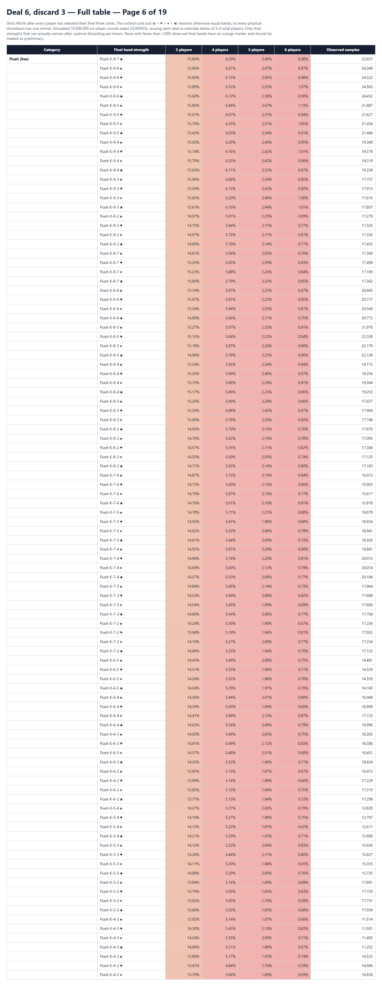

*รูปที่ 5.82 ตาราง Win% เต็มของ d6 ส่วนที่ 6/19 แถวที่ 501–600 จากทั้งหมด 1,857 แถว ตั้งแต่ Flush K-9-7 ♣ ถึง Flush K-4-2 ♦*

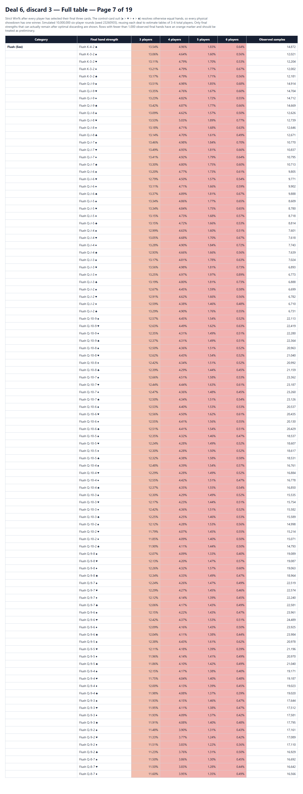

*รูปที่ 5.83 ตาราง Win% เต็มของ d6 ส่วนที่ 7/19 แถวที่ 601–700 จากทั้งหมด 1,857 แถว ตั้งแต่ Flush K-4-2 ♣ ถึง Flush Q-8-7 ♦*

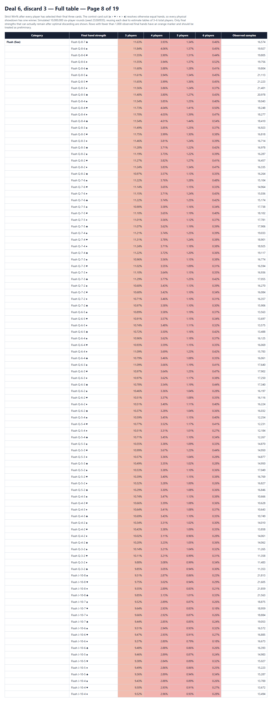

*รูปที่ 5.84 ตาราง Win% เต็มของ d6 ส่วนที่ 8/19 แถวที่ 701–800 จากทั้งหมด 1,857 แถว ตั้งแต่ Flush Q-8-7 ♣ ถึง Flush J-10-4 ♦*

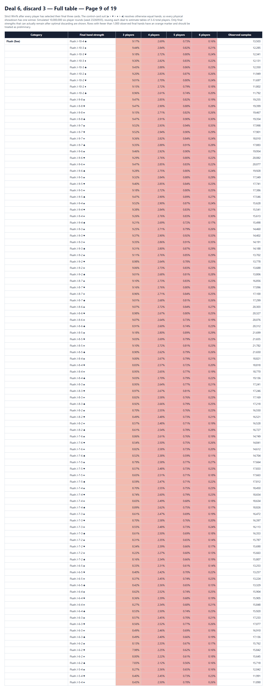

*รูปที่ 5.85 ตาราง Win% เต็มของ d6 ส่วนที่ 9/19 แถวที่ 801–900 จากทั้งหมด 1,857 แถว ตั้งแต่ Flush J-10-4 ♣ ถึง Flush J-5-4 ♦*

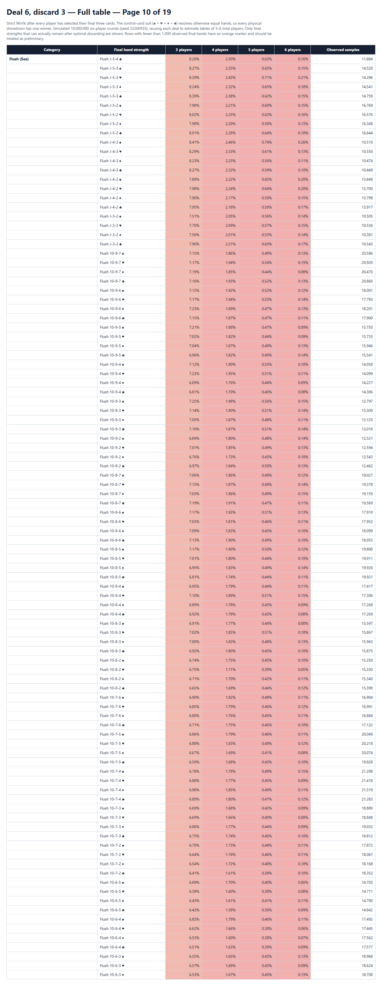

*รูปที่ 5.86 ตาราง Win% เต็มของ d6 ส่วนที่ 10/19 แถวที่ 901–1,000 จากทั้งหมด 1,857 แถว ตั้งแต่ Flush J-5-4 ♣ ถึง Flush 10-6-3 ♦*


*รูปที่ 5.87 ตาราง Win% เต็มของ d6 ส่วนที่ 11/19 แถวที่ 1,001–1,100 จากทั้งหมด 1,857 แถว ตั้งแต่ Flush 10-6-3 ♣ ถึง Flush 9-4-3 ♦*


*รูปที่ 5.88 ตาราง Win% เต็มของ d6 ส่วนที่ 12/19 แถวที่ 1,101–1,200 จากทั้งหมด 1,857 แถว ตั้งแต่ Flush 9-4-3 ♣ ถึง Flush 7-3-2 ♦*

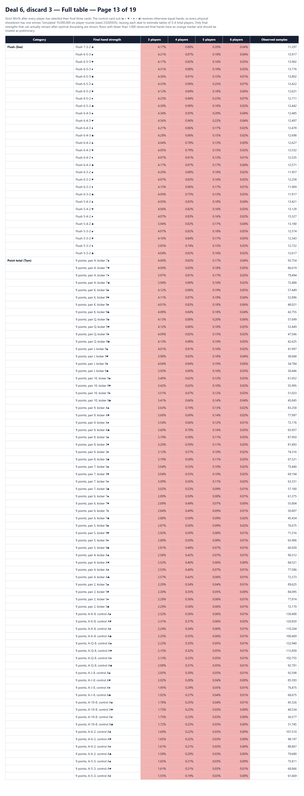

*รูปที่ 5.89 ตาราง Win% เต็มของ d6 ส่วนที่ 13/19 แถวที่ 1,201–1,300 จากทั้งหมด 1,857 แถว ตั้งแต่ Flush 7-3-2 ♣ ถึง 9 points, A-5-3, control A♦*


*รูปที่ 5.90 ตาราง Win% เต็มของ d6 ส่วนที่ 14/19 แถวที่ 1,301–1,400 จากทั้งหมด 1,857 แถว ตั้งแต่ 9 points, A-5-3, control A♣ ถึง 8 points, pair Q, kicker 8♦*


*รูปที่ 5.91 ตาราง Win% เต็มของ d6 ส่วนที่ 15/19 แถวที่ 1,401–1,500 จากทั้งหมด 1,857 แถว ตั้งแต่ 8 points, pair Q, kicker 8♣ ถึง 8 points, K-10-8, control K♦*

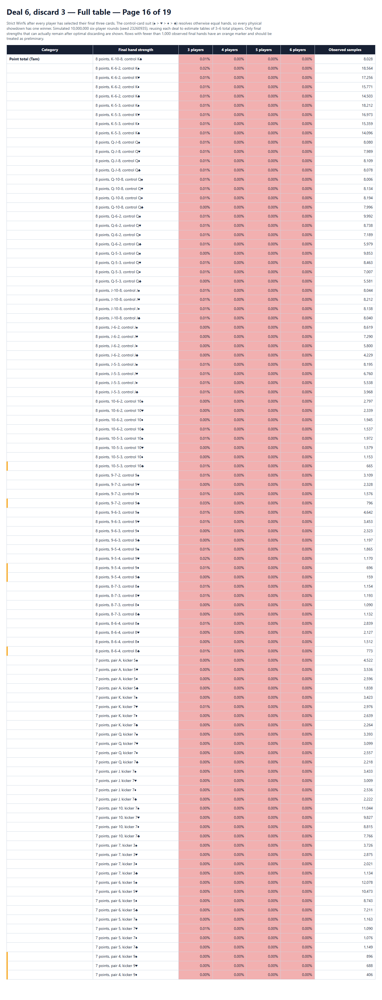

*รูปที่ 5.92 ตาราง Win% เต็มของ d6 ส่วนที่ 16/19 แถวที่ 1,501–1,600 จากทั้งหมด 1,857 แถว ตั้งแต่ 8 points, K-10-8, control K♣ ถึง 7 points, pair 4, kicker 9♦*


*รูปที่ 5.93 ตาราง Win% เต็มของ d6 ส่วนที่ 17/19 แถวที่ 1,601–1,700 จากทั้งหมด 1,857 แถว ตั้งแต่ 7 points, pair 4, kicker 9♣ ถึง 7 points, 7-6-4, control 7♠*

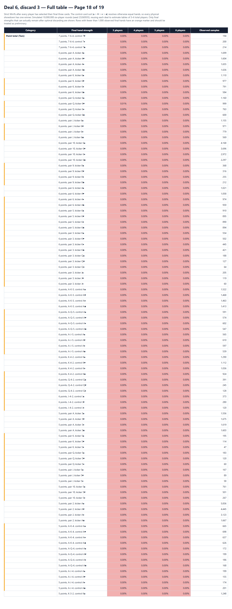

*รูปที่ 5.94 ตาราง Win% เต็มของ d6 ส่วนที่ 18/19 แถวที่ 1,701–1,800 จากทั้งหมด 1,857 แถว ตั้งแต่ 7 points, 7-6-4, control 7♥ ถึง 5 points, K-3-2, control K♠*

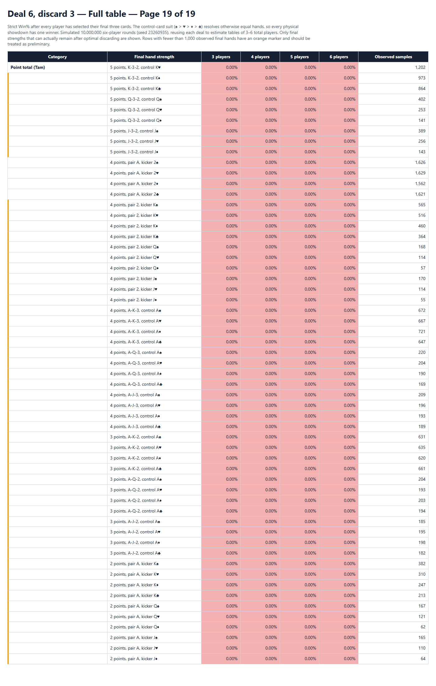

*รูปที่ 5.95 ตาราง Win% เต็มของ d6 ส่วนที่ 19/19 แถวที่ 1,801–1,857 จากทั้งหมด 1,857 แถว ตั้งแต่ 5 points, K-3-2, control K♥ ถึง 2 points, pair A, kicker J♦*

## 6. อภิปรายผล

### 6.1 วิธีแจกเป็นส่วนหนึ่งของความหมายของ Win%

ผลแสดงชัดว่าค่า Win% ไม่ได้เป็นคุณสมบัติของไพ่สามใบเพียงอย่างเดียว ไพ่สุดท้ายเหมือนกันสามารถมีโอกาสชนะต่างกันมาก เพราะวิธีแจกกำหนดทั้งความแข็งของมือ hero ที่ผ่านการคัดเลือกมาและความแข็งของมือคู่แข่ง ใน d3 ไพ่สามใบทุกชุดสามารถเป็นมือสุดท้ายได้โดยตรง แต่ใน d6 ผู้เล่นแต่ละคนเปรียบเทียบชุดย่อย 20 ชุดก่อนเลือกมือ ส่งผลให้โต๊ะเต็มไปด้วยหมวดสูงกว่าแต้มมากขึ้น

ดังนั้นการนำตารางไปใช้ควรระบุอย่างน้อยสามค่าเสมอ: strength ของมือสุดท้าย วิธีแจก และจำนวนผู้เล่นที่ showdown การรายงานเพียงว่า “มือชนิดนี้ชนะกี่เปอร์เซ็นต์” โดยไม่บอกเงื่อนไขทั้งสามอาจทำให้ผู้อ่านเข้าใจผิด

### 6.2 ผลของจำนวนผู้เล่น

เมื่อมีคู่แข่งมากขึ้น hero ต้องชนะมือเพิ่มขึ้นทุกคน โอกาสเป็นผู้ชนะคนเดียวจึงลดลงหรือคงเดิมตามจำนวนผู้เล่นในผลที่ตรวจสอบ อย่างไรก็ตามอัตราที่ลดไม่เท่ากันทุก strength เพราะไพ่ที่ hero ถือเอาไพ่บางใบออกจากสำรับ และการเลือกมือของคู่แข่งในกติกา d4–d6 ขึ้นกับไพ่ส่วนเกินของแต่ละคนด้วย

### 6.3 ลำดับไพ่กับ conditional Win% เป็นคนละสิ่ง

ลำดับหมวดเป็นกฎแบบ deterministic: สีชนะมือแต้มทุกครั้งเมื่อพบกันโดยตรง ส่วน Win% ในตารางเป็นค่าแบบมีเงื่อนไขที่เฉลี่ยเหนือดีลของคู่แข่งซึ่งยังเป็นไปได้หลังทราบไพ่ของ hero ดังนั้น Win% ของสองแถวที่อยู่ใกล้กันไม่จำเป็นต้องเรียงอย่างสมบูรณ์ตามอันดับ โดยเฉพาะเมื่อแถวถือไพ่คนละใบและตัดชุดไพ่ที่เป็นไปได้ของคู่แข่งไม่เหมือนกัน นอกจากนี้ Monte Carlo noise จะเห็นได้ชัดในแถวตัวอย่างน้อย

ประเด็นนี้อธิบายกรณีที่ผู้อ่านอาจเห็น 9 แต้มบางแถวมี estimated Win% สูงกว่าสีบางแถวในตาราง: ไม่ได้แปลว่า 9 แต้มชนะสีเมื่อชนกัน แต่เป็นการเปรียบเทียบโอกาสชนะต่อสนามคู่แข่งที่มีเงื่อนไขและ blocker ต่างกัน หากต้องการเปรียบเทียบลำดับมือโดยตรง ให้ใช้กติกาหมวด ไม่ใช้ Win% ข้ามแถวเป็นตัวแทนกฎการตัดสิน

### 6.4 ความหมายเชิงใช้งานและสิ่งที่ยังสรุปไม่ได้

ตารางนี้เหมาะสำหรับตอบว่า “ถ้าไปถึง showdown ด้วยมือนี้ ภายใต้กติกานี้และจำนวนผู้เล่นเท่านี้ โอกาสชนะประมาณเท่าใด” ยังไม่เหมาะสำหรับตอบว่า “ควรจ่าย ควรเพิ่ม หรือควรหมอบหรือไม่” เพราะการตัดสินใจนั้นต้องพิจารณากองกลาง \(P\) เงินที่ต้องจ่ายเพิ่ม \(C\) จำนวนรอบเดิมพันในอนาคต ความเป็นไปได้ที่คนอื่นหมอบ และพฤติกรรมคู่แข่ง การใช้เกณฑ์ pot odds เช่น \(C/(P+C)\) จะเหมาะเฉพาะสถานการณ์ที่นิยามการจ่ายและไม่มีการเดิมพันต่ออย่างชัดเจน จึงควรแยกเป็นงานวิจัยระยะถัดไป

### 6.5 ความสำคัญของไพ่ส่วนเกินและ blocker

ใน d4–d6 ตารางปัจจุบันเฉลี่ยเหนือไพ่ที่แจกเกินสามใบทั้งหมด แต่ในการเล่นจริงผู้เล่นรู้ไพ่เหล่านั้น แม้จะทิ้งไปแล้ว ไพ่ดังกล่าวยังออกจากสำรับและอาจเปลี่ยนการกระจายมือคู่แข่ง งานระยะต่อไปจึงสามารถสร้าง Win% แบบมีเงื่อนไขต่อ “ไพ่ที่เห็นทั้งหมด” แทนการมีเงื่อนไขเฉพาะมือสุดท้ายสามใบ ซึ่งจะให้คำตอบเฉพาะสถานการณ์มากขึ้น แต่ทำให้ state space และขนาดตารางเพิ่มขึ้นมาก

## 7. ข้อจำกัด

1. ชุดกติกานี้เป็น operational house ruleset สำหรับโครงการ ไม่ใช่กติกาสากลของ 9-Bets และยังต้องให้ผู้เล่นจากหลายวงตรวจสอบความตรงเชิงเนื้อหา
2. ความถี่และ reachability มาจาก exact enumeration แต่ Win% เป็น Monte Carlo estimate ไม่ใช่ค่า exact
3. ใช้ seed เดียวต่อขนาดการแจกและยังไม่มี independent replications หรือ confidence intervals ที่คำนึงถึง clustering ระดับโต๊ะ
4. hero observations หกค่าจากโต๊ะเดียวกันสัมพันธ์กัน จึงห้ามอธิบายผลว่าเป็น 240 ล้าน independent samples
5. แถวหายาก โดยเฉพาะ d6 ที่ต่ำสุด 47 observations มีความไม่แน่นอนสูง แม้ทุก reachable row จะถูกพบอย่างน้อยหนึ่งครั้ง
6. หนึ่งแถวรวมรูปแบบดอกของไพ่ที่ไม่ใช่ตัวคุม และในกติกาทิ้งไพ่ยังเฉลี่ยรวมไพ่ที่ไม่ได้ใช้ จึงไม่ใช่ค่าที่มีเงื่อนไขต่อข้อมูลไพ่ทั้งหมดที่ผู้เล่นเห็น
7. สมมติว่าทุกคนเลือกชุดสามใบที่มีอันดับ showdown สูงสุดเสมอ ไม่รวมความผิดพลาด การทิ้งเชิงหลอก หรือการเลือกมืออ่อนเพื่อเหตุผลด้านการเดิมพัน
8. ไม่มี ante, pot, call, raise, fold, position, bluff หรือแบบจำลองพฤติกรรม จำนวนผู้เล่นในตารางคือจำนวนคนที่ถึง showdown ไม่จำเป็นต้องเท่าจำนวนคนเริ่มมือในเกมจริง
9. ผล d3 ใช้ร่วมกับการแจกสามใบพร้อมกันและ 2+1 เฉพาะเมื่อไม่จำลองการเดิมพันและการหมอบ แม้แบบแรกเดิมพันหนึ่งรอบและแบบหลังเดิมพันสองรอบ หากการหมอบหลังสองใบขึ้นกับข้อมูลไพ่ ผู้เล่นที่เหลือไม่ใช่ตัวอย่างสุ่มจากผู้เริ่มมือ และตารางนี้ไม่ประมาณเงื่อนไขนั้น งานจึงไม่อนุมานว่ากลยุทธ์ของสองแบบเหมือนกัน
10. งานไม่รวม community cards, joker, หลายสำรับ หรือโต๊ะที่มีผู้เล่นเกินหกคนในการคำนวณ Win% ปัจจุบัน
11. การผ่านชุดทดสอบ 23 ข้อเป็น internal consistency check ไม่ใช่การยืนยันอิสระของกติกา ข้อมูล หรือผล Monte Carlo
12. ยังไม่มีการทดลองกับการเล่นจริงเพื่อวัดว่าผู้เล่นเลือกมือได้ถูกต้องเพียงใด หรือ table Win% ช่วยการตัดสินใจได้จริงหรือไม่

## 8. สรุป

งานนี้สร้างฐานเชิงปริมาณสำหรับการเปิดไพ่ 9-Bets ภายใต้ชุดกติกาที่ระบุชัด โดยแยกสิ่งที่คำนวณ exact ได้ออกจากสิ่งที่ต้องประมาณด้วย Monte Carlo การไล่ครบทุกชุดไพ่แสดงว่าการเพิ่มไพ่ให้เลือกจากสามเป็นหกใบเปลี่ยนการกระจายมืออย่างมาก: หมวดแต้มลดจากประมาณ 90.68% เหลือ 20.32% ขณะที่หมวดเรียงและสีเพิ่มขึ้นมาก ผลจำลอง 10 ล้านโต๊ะต่อขนาดการแจกแสดงต่อไปว่ามือสุดท้ายเดียวกันมี Win% ต่างกันอย่างมากตามขนาดการแจกและจำนวนผู้เล่น

ข้อสรุปที่สำคัญที่สุดคือ Win% ต้องมีบริบท ไม่ควรแยกออกจากกติกาการแจก จำนวนคนที่เปิดไพ่ และนิยาม strength ที่ใช้ ตารางฉบับนี้ให้คำตอบเฉพาะโอกาสชนะเมื่อไปถึง showdown และยังไม่ใช่คำแนะนำให้เล่นหรือหมอบ การแยกขอบเขตดังกล่าวช่วยให้ผลตรวจสอบได้ และวางฐานที่เหมาะสมสำหรับงานด้านการเดิมพันในระยะต่อไป

## 9. งานวิจัยระยะต่อไป

ลำดับงานที่แนะนำหลังเผยแพร่ฉบับฐานนี้มีดังต่อไปนี้

1. ทำ Monte Carlo ซ้ำหลาย seed หรือใช้ round-level cluster bootstrap เพื่อรายงาน uncertainty interval ของ Win% ทุกแถว
2. เพิ่ม Win% ที่มีเงื่อนไขต่อไพ่ส่วนเกิน/ไพ่ทิ้งจริง เพื่อวัด blocker effect ที่ผู้เล่นรู้ใน d4–d6
3. ตรวจสอบชุดกติกากับผู้เล่นหลายวงและรายงาน variant ของกติกาแทนการรวมเป็นแบบเดียว
4. เปรียบเทียบผลจำลองกับข้อมูลการเล่นจริงโดยไม่บันทึกข้อมูลส่วนบุคคลที่ไม่จำเป็น
5. สร้างงานระยะที่สองด้านการหมอบและการเดิมพัน โดยกำหนด \(P\) กองกลางก่อนตัดสินใจ, \(C\) เงินที่ต้องจ่าย, จำนวนผู้เล่นที่ยังอยู่, จำนวนครั้งที่เพิ่มเดิมพันได้ และการมีเดิมพันต่อให้ชัดก่อนใช้ pot odds
6. ศึกษาความไวต่อช่วงเดิมพันของแต่ละวง รวมทั้งบริบทเกมต่อเนื่องที่ผู้เล่นไม่มี stack จำกัดแบบ tournament
7. เพิ่มกลยุทธ์คู่แข่งและความน่าจะเป็นที่ผู้เล่นแต่ละประเภทจะหมอบ เพื่อเปลี่ยนจาก showdown Win% เป็น decision model

## 10. ข้อมูล โค้ด และการทำซ้ำ

ซอร์สโค้ด ตารางผล และไฟล์ประกอบเผยแพร่ที่ [GitHub repository: ssirawiitch/9-Bets](https://github.com/ssirawiitch/9-Bets) [7] เพื่อให้การทำซ้ำอ้างถึงชุดไฟล์เดียวกับบทความ ฉบับเผยแพร่ควรระบุ release tag หรือ commit SHA ที่ตรงกับผลรายงาน ชื่อไฟล์กลุ่ม gaogae_*.py เป็นตัวระบุทางเทคนิคเดิมที่คงไว้เพื่อความเข้ากันได้และการทำซ้ำ ไม่ใช่ชื่อเกมที่บทความนี้ใช้

### 10.1 ไฟล์หลัก

| ไฟล์/โฟลเดอร์ | หน้าที่ |
|---|---|
| `RULES.md` | นิยามชุดกติกาปฏิบัติการ |
| `gaogae_core.py` | การแทนไพ่ การจำแนกมือ และตัวเปรียบเทียบ |
| `gaogae_full_winrate.py` | exact enumeration และ Monte Carlo ของตารางเต็ม |
| `export_winrate_png.py` | ส่งออก HTML เป็น PNG แบบแบ่งหน้า |
| `test_gaogae_core.py` | ชุดทดสอบ 23 ข้อ |
| `full_winrate/*.csv` | ข้อมูลตารางเต็มที่อ่านด้วยโปรแกรมได้ |
| `full_winrate/*.html` | ตารางสีสำหรับเปิดใน browser |
| `full_winrate/png/*.png` | รูปที่ใช้ในบทความนี้ |
| `full_winrate/METHODOLOGY.md` | คำอธิบายผลและวิธีคำนวณฉบับย่อ |

### 10.2 คำสั่งทำซ้ำ

จากโฟลเดอร์โครงการ ใช้คำสั่งต่อไปนี้

```bash
python3 -B -m unittest -v
python3 -B gaogae_full_winrate.py --rounds 10000000 --output-dir full_winrate
python3 -B export_winrate_png.py
```


## 11. รายการอ้างอิง

รายการ [1]–[2] ใช้บันทึกบริบทและความแตกต่างของกติกาที่เผยแพร่ต่อสาธารณะ ไม่ได้ใช้เป็นอำนาจกำหนดชุดกติกาปฏิบัติการของงานนี้ ส่วน [3]–[4] เป็นแหล่งของเกมไพ่สามใบที่เกี่ยวข้อง ไม่ใช่กติกาของ 9-Bets

1. Thai Playing Card. (n.d.). *[NINEKA (เก้าเก): วิธีการเล่นไพ่เก้าเก](https://thaiplayingcard.com/วิธีการเล่นไพ่เก้าเก/)*. สืบค้นเมื่อ 29 กันยายน 2026.
2. SoccerSuck. (2020, June 11). *[ไพ่เก้าเก](https://www.soccersuck.com/boards/topic/1890614)* [กระทู้สนทนาออนไลน์].
3. Gambling Regulatory Authority of Singapore. (n.d.). *[Three Card Poker](https://www.gra.gov.sg/docs/default-source/game-rules/rws/poker-games/three-card-poker_v2.pdf?sfvrsn=3597cc12_1)* [Game rules].
4. Banerjee, T., De, A., Maitra, S., & Mukherjee, D. (2024). *[Skill vs. Chance Quantification for Popular Card & Board Games](https://arxiv.org/abs/2410.14363)* [Preprint]. arXiv:2410.14363.
5. Metropolis, N., & Ulam, S. (1949). *[The Monte Carlo Method](https://doi.org/10.1080/01621459.1949.10483310)*. Journal of the American Statistical Association, 44(247), 335–341.
6. Field, C. A., & Welsh, A. H. (2007). *[Bootstrapping clustered data](https://doi.org/10.1111/j.1467-9868.2007.00593.x)*. Journal of the Royal Statistical Society: Series B (Statistical Methodology), 69(3), 369–390.
7. ssirawiitch. (2026). *[9-Bets](https://github.com/ssirawiitch/9-Bets)* [Source code and data]. GitHub.
